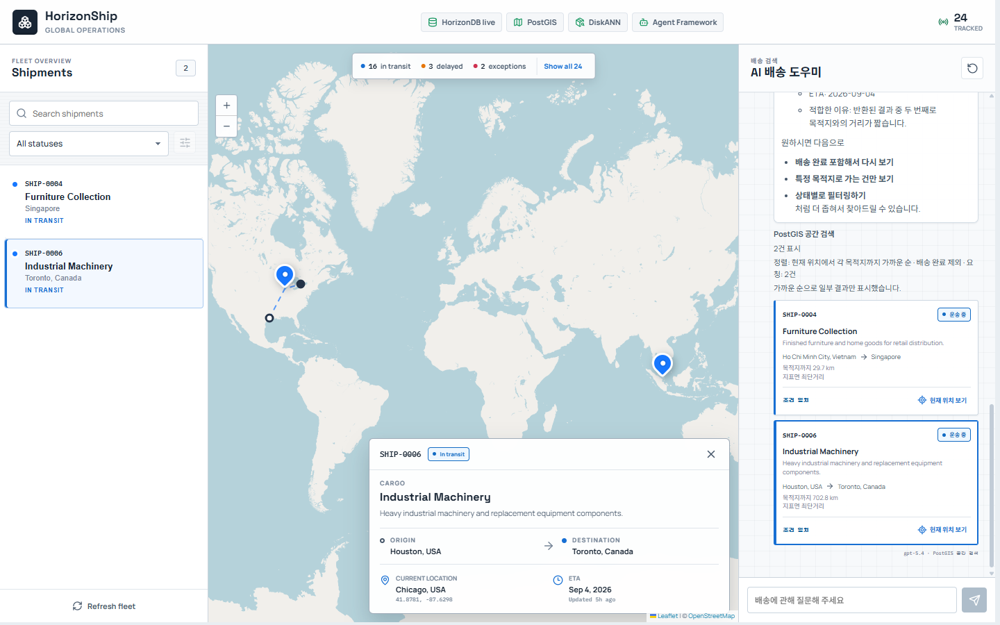
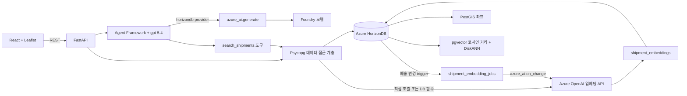
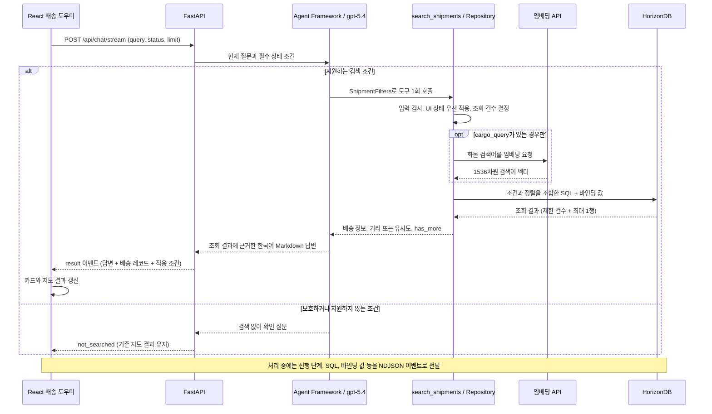

# HorizonShip

HorizonShip은 배송 현황 조회, 지도 표시, 자연어 검색을 함께 구현한 샘플 애플리케이션입니다.

화면 이름은 **Fleet Intelligence**이며, 왼쪽 **Search Workbench**에서 조건을 직접 지정하거나
오른쪽 **Agent with Tools**에 자연어로 질문할 수 있습니다.
백엔드는 FastAPI로 API를 처리하고 Psycopg 3로 Azure HorizonDB에 연결합니다.
프론트엔드는 React로 화면을 구성하며, Vite를 개발 서버와 빌드 도구로 사용합니다.

배송 조회 흐름에서 다음 기능을 확인할 수 있습니다.

- PostGIS는 출발지, 도착지, 현재 배송 위치를 SRID 4326의 Point로 저장합니다.
  화면은 이 좌표를 Leaflet 세계 지도에 표시하며, 반경 검색은 `ST_DWithin`으로 검사합니다.
- Azure OpenAI의 `text-embedding-3-small`은 화물명·설명·지명·상태·metadata를 합친 텍스트를 1,536차원 벡터로 변환합니다.
  초기 데이터는 setup이 backfill하고, 이후 의미 필드 변경은 HorizonDB `azure_ai` pipeline이 처리합니다.
  검색어 벡터는 요청 시 생성하며 직접 API 호출과 DB 함수 호출 중 선택합니다.
- pgvector의 코사인 거리 연산자(`<=>`)로 자연어 검색 결과의 순서를 정합니다.
- 벡터 후보 검색용 DiskANN 인덱스에 4-bit spherical quantization과 필터 검색 설정을 적용합니다.
  실제 인덱스 사용 여부는 실행 계획에 따라 달라지며, 샘플 24건만으로 성능 향상을 입증하지는 않습니다.
- Microsoft Agent Framework는 `gpt-5.4` 기반 배송 어시스턴트를 실행합니다.
  모델은 직접 API 또는 HorizonDB `azure_ai.generate`로 호출합니다.
  어시스턴트는 정확한 조건을 SQL·PostGIS로 검사하고, 화물의 의미를 찾을 때만 벡터 검색을 추가합니다.

저장소에는 실제 배송 상황을 가정한 전 세계 배송 샘플 24건이 포함되어 있습니다.
의미 검색과 어시스턴트 응답은 실제 클라우드 서비스를 호출하므로 HorizonDB와 Azure OpenAI 설정이 필요합니다.

## 사용자 화면



본문과 제목은 Pretendard를 사용하며 SQL은 고정폭 폰트를 유지합니다. 한글 폰트는 버전이 고정된 CDN에서
불러오고, 연결할 수 없으면 설치된 한글 폰트로 표시합니다. 초기 예시에는 상태·권역·반경뿐 아니라
ETA 기간, 의미·근접도 가중 정렬, 목적지 거리순 검색도 포함합니다.

### 발표·시연 문서

[문서 안내](docs/README.md)에서 현재 구현 기준의 한국어 자료를 확인할 수 있습니다.
[18장 HTML 발표자료](docs/fleet-intelligence-slides.html), [발표자 노트](docs/presenter-notes.md),
[기술 설명 HTML](docs/blog-post.html)과 [Markdown 원고](docs/blog-post.md)를 함께 제공합니다.
참고 프로젝트의 출처, 고정 커밋 링크와 MIT 라이선스는 [문서 출처와 라이선스](docs/THIRD-PARTY-NOTICES.md)에 있습니다. 원본 문서·이미지의 중복 보관본은 제거하고 발표자료에 사용하는 CSS만 별도로 유지합니다.

## 아키텍처



어시스턴트는 배송 데이터를 임의로 생성하지 않고 조회 결과를 바탕으로 답하도록 구성되어 있습니다.
지원하는 조건이면 `search_shipments`를 한 번 호출하며, API는 답변과 함께 도구가 반환한 배송 레코드를 그대로 전달합니다.
지원하지 않거나 모호한 조건은 검색하지 않고 확인 질문을 하도록 지시합니다. 이전 대화 내역은 서버에 전달하지 않으므로
확인 후에는 필요한 조건을 포함한 완전한 질문으로 다시 요청합니다.
브라우저는 이 레코드로 검색 결과 카드를 표시하고 지도에 표시할 배송을 필터링합니다.

### AI 배송 도우미의 질의 처리 흐름

**AI는 질문을 구조화된 검색 조건으로 해석하고, 백엔드는 SQL을 조합하며, HorizonDB는 그 SQL을 실행합니다.**
AI가 작성한 임의의 SQL을 실행하는 구조는 아닙니다. DB provider도 모델이 반환한 JSON을
Python에서 검사한 뒤 기존 도구를 실행합니다.
SQL·공간·벡터 검색은 별도 DB를 조회하지 않습니다. 배송 데이터와 벡터는 같은 HorizonDB 안에서
`shipment_id` FK로 연결된 테이블에 나눠 저장합니다.
이는 PostgreSQL·PostGIS·pgvector 기능을 HorizonDB에서 함께 사용하는 예시이며, 모두 HorizonDB만의 고유 기능은 아닙니다.



1. 브라우저가 현재 질문, 화면의 상태 필터, 표시 상한을 전달합니다. 대화 기록 전체는 전송하지 않습니다.
2. Agent가 질문을 [ShipmentFilters](backend/app/models.py)로 해석합니다. 상태·지명·권역은 정확한 조건에,
   화물의 의미는 `cargo_query`에 넣습니다. 한국어 지명은 등록된 영문 이름으로 대응합니다.
3. [검색 도구](backend/app/agent.py)가 입력을 검사하고 화면에서 지정한 상태를 우선 적용합니다.
   [Repository](backend/app/repository.py)는 등록된 장소·권역과 조건 조합을 검사합니다.
   열 이름과 정렬식은 코드에서 선택하고, 사용자 조건값은 Psycopg의 `%s` 바인딩으로 전달합니다.
4. `cargo_query`가 있을 때만 임베딩을 생성합니다. 설정에 따라 백엔드가 API를 직접 호출하거나
  DB의 `azure_openai.create_embeddings`를 호출합니다. 배송 벡터는 DB 준비 시 저장해 두고,
   검색 시에는 질문에서 추출한 화물 검색어의 벡터만 생성합니다. Agent가 검색어를 번역하거나 요약할 수 있습니다.
5. HorizonDB가 조건을 검사하고 결과를 정렬합니다. 요청 건수와 API 상한 중 작은 값을 적용하고,
   한 행을 더 조회해 `has_more`를 판단한 뒤 표시할 배송만 반환합니다.
6. Agent는 도구가 돌려준 배송 번호·경로·상태·ETA·거리·유사도로 답변을 작성합니다.
   API의 배송 레코드는 답변 문장에서 다시 추출하지 않고 도구 결과를 그대로 사용합니다.

조건 추출과 답변 작성에는 모델 판단이 들어갑니다. 아래 예시는 의도한 매핑이며, 모든 표현이 항상 같은
필터로 해석됨을 보장하지는 않습니다. 실제 해석은 대화의 `실행 내역`에 표시되는 적용 조건으로 확인합니다.

### 질문과 검색 방식 매핑

표의 필터는 필요한 필드만 표시했습니다. `cargo_query`가 없는 검색은 검색어 임베딩을 호출하지 않습니다.

| 질문 예시 | 구조화된 필터 예시 | DB 처리 | search_mode |
| --- | --- | --- | --- |
| 지연된 배송 | `status: "delayed"` | 상태 일치 | `sql` |
| SHIP-0004를 찾아주세요 | `shipment_number: "SHIP-0004"` | 배송 번호 일치 | `sql` |
| 로테르담으로 가는 배송 | `destination_name: "Rotterdam, Netherlands"` | 도착지 이름 일치 | `sql` |
| 아시아권이 출발지인 배송 | `origin_region: "Asia"` | 출발 좌표에 `ST_Covers` | `gis` |
| 유럽으로 가는 지연된 배송 | `destination_region: "Europe", status: "delayed"` | 도착 좌표에 `ST_Covers` + 상태 일치 | `gis` |
| 부산 반경 100km 이내에서 출발한 배송 | `nearby_location: "Busan, South Korea", position_field: "origin", radius_km: 100` | 출발 좌표에 `ST_DWithin` | `gis` |
| 현재 부산 반경 100km 이내인 배송 | `nearby_location: "Busan, South Korea", position_field: "current", radius_km: 100` | 현재 좌표에 `ST_DWithin` | `gis` |
| 목적지에 가장 가까운 2개 | `sort_by: "destination_distance", result_limit: 2` | 현재 위치와 각 도착지의 `ST_Distance` 오름차순 | `gis` |
| 로테르담으로 가는 운송 중 배송 중 목적지에 가장 가까운 2개 | `destination_name: "Rotterdam, Netherlands", status: "in_transit", sort_by: "destination_distance", result_limit: 2` | 도착지·상태 일치 + 목적지 거리순 | `gis` |
| 의료기관에 필요한 화물 | `cargo_query: "medical supplies"` | 화물 검색어 임베딩 + 코사인 거리순 | `diskann_cosine` |
| 지연된 의료용품 배송 | `status: "delayed", cargo_query: "medical supplies"` | 상태 일치 + 코사인 거리순 | `hybrid` |
| 아시아에서 출발한 의료용품 | `origin_region: "Asia", cargo_query: "medical supplies"` | 출발 좌표에 `ST_Covers` + 코사인 거리순 | `hybrid` |
| 2026년 9월 15~17일 도착 예정 배송 | `eta_start: "2026-09-15", eta_end: "2026-09-17"` | 저장된 ETA 범위, 양 끝 포함 | `sql` |
| 현재 부산 반경 500km의 의료용품을 관련성과 거리 가중 순으로 | `cargo_query: "medical supplies", nearby_location: "Busan, South Korea", radius_km: 500, sort_by: "semantic_spatial"` | 반경 조건 + 의미 72%·근접도 28% 점수순 | `hybrid` |

`search_mode`는 다음 규칙으로 결정합니다. SQL·GIS 모드도 내부적으로는 모두 SQL을 실행합니다.

| 모드 | 결정 조건 | 기본 결과 순서 |
| --- | --- | --- |
| `sql` | 화물 의미 검색과 공간 조건 없이 상태·배송 번호·장소명 등으로 조회 | 배송 번호순 |
| `gis` | 화물 의미 검색 없이 권역·반경·목적지 거리 정렬 중 하나 사용 | 배송 번호순, 목적지 거리 정렬을 요청하면 거리순 |
| `diskann_cosine` | `cargo_query`만 있고 정확한 상태·번호·장소·권역·반경 조건은 없음 | 코사인 거리 오름차순 |
| `hybrid` | `cargo_query`와 정확한 조건(ETA 포함)을 함께 사용 | 기본 코사인 거리순, 명시적 `semantic_spatial`은 가중 점수순 |
| `not_searched` | Agent가 도구를 호출하지 않고 확인 질문으로 응답 | 새 배송 결과 없음 |

`result_limit`만 추가해도 모드가 바뀌지는 않습니다. 화면에서 상태를 선택한 상태로 화물 의미 검색을 하면
필수 상태 조건이 추가되므로 `hybrid`가 됩니다. 반경 검색 자체는 거리순 정렬이 아닙니다.
현재 위치가 아닌 출발·도착 좌표를 검색했더라도 지도 마커는 배송의 `current_position`을 표시합니다.

### 필터별 의미와 제한

왼쪽 직접 검색은 `POST /api/search/criteria`를 호출하며 Agent의 조건 해석·답변 생성을 거치지 않습니다.
`Search intent`에 입력한 화물 검색어는 그대로 임베딩합니다. 상태·ETA·위치 조건은 해당 컨트롤에서 지정하며,
검색어가 비어 있으면 임베딩 없이 조건만으로 조회합니다. 검색 버튼이나 Enter로 적용하기 전에는 결과가 바뀌지 않습니다.

ETA는 중심일과 ±일수(0~365)를 서버에서 날짜 범위로 계산하고 양 끝 날짜를 포함합니다.
`Map radius`를 켜고 지도를 클릭하면 선택한 좌표와 반경으로 배송의 **현재 위치**를 검사합니다.
반경은 화면에서 50~3,000km까지 지정합니다. 반경 원은 현재 입력 조건을 표시하며, 검색 뒤 조건을 바꾸면
`Unapplied changes`가 표시됩니다. 일반 마커 선택은 반경 조건을 추가하지 않습니다.

기본 정렬은 화물 검색어가 있으면 의미 유사도순, 없으면 배송 번호순입니다.
검색어와 지도 기준점이 모두 있을 때만 의미 72%·근접도 28% 가중 정렬을 선택할 수 있습니다.
직접 검색은 최대 24건을 반환하고 추가 결과 여부를 표시합니다. `Clear`는 조건·반경·결과를 초기화합니다.
채팅은 기존처럼 화면의 상태 선택만 추가로 적용하며, 왼쪽 ETA·반경·검색어를 자동으로 가져오지 않습니다.
채팅 검색이 성공하면 왼쪽 목록은 `Agent matches`로 바뀝니다.

지도 좌표용 `nearby_point`는 수동 검색에서만 받으며 Agent 도구의 JSON Schema에서는 제외합니다.
모델이 이 필드를 보내더라도 도구 실행 전에 거부합니다. 아래 표의 장소·권역 규칙은 채팅 검색 기준입니다.

| 필드 | 의미와 검사 방식 |
| --- | --- |
| `status` | `in_transit`, `delivered`, `delayed`, `exception`, `unknown` 중 하나로 일치 검사 |
| `shipment_number` | `SHIP-0004` 같은 배송 번호 일치 검사 |
| `origin_name`, `destination_name` | 등록된 장소명과 출발지·도착지 이름 일치 검사. 국가 전체나 좌표 반경 조건이 아님 |
| `origin_region`, `destination_region` | `Asia`, `Middle East`, `Europe`, `North America`, `South America`, `Africa`, `Oceania` 경계와 해당 좌표 비교 |
| `nearby_location`, `radius_km` | 등록된 기준 도시와 반경을 함께 지정. km를 미터로 바꿔 `ST_DWithin`에 전달 |
| `position_field` | 반경을 검사할 좌표: `origin`, `destination`, `current`. 기본값은 `current` |
| `cargo_query` | 화물 의미 검색어. 상태·지리·배송 번호·표시 지시는 넣지 않음 |
| `eta_start`, `eta_end` | ISO 날짜 범위, 양 끝 포함. 한쪽만 지정 가능. 시작일이 종료일보다 늦으면 거부하며 ETA가 없는 레코드는 제외 |
| `sort_by` | `destination_distance`는 각 배송의 자기 도착지 거리순. `semantic_spatial`은 화물 의미와 기준점 근접도 가중 점수순 |
| `result_limit` | 요청 건수 1~24. 실제 표시 건수는 API의 `limit` 상한도 적용 |

지원하지 않는 국가 전체 조건, 임의의 제외 조건, 등록되지 않은 장소는 확인 질문 대상으로
지시합니다. `도착이 임박한 배송`처럼 거리와 ETA 중 기준이 불분명하면 먼저 기준을 확인합니다.
ETA 정렬과 화물 의미 검색·목적지 거리 정렬의 동시 사용은 지원하지 않습니다.
거리순 검색의 기본 배송 완료 제외는 코드에 정해진 동작이며, 일반적인 제외 조건 지원을 뜻하지 않습니다.
입력 검사나 외부 API·DB 호출이 실패하면 오류로 처리하며, 이를 검색 결과 0건이나 확인 질문으로 바꾸지 않습니다.

ETA의 오늘·내일·이번 주·다음 주는 요청을 시작할 때 `SEARCH_TIMEZONE`(기본 `Asia/Seoul`)의 날짜를
모델 지침에 넣어 해석합니다. 주 단위는 월요일부터 일요일이며, 중심 날짜 ±N일은 시작일·종료일로
변환합니다. 모호한 기간은 확인 질문을 합니다. 날짜 계산은 모델이 하므로 실행 내역에서 확정된 날짜를
확인해야 합니다. 이 조건은 저장된 도착 예정일을 검사하며 실제 도착 이력을 조회하지 않습니다.

`semantic_spatial`은 `cargo_query`, `nearby_location`, `radius_km`이 모두 있어야 합니다.
`position_field`의 좌표에서 기준 도시까지 거리를 계산하고 아래 점수를 내림차순으로 정렬합니다.
동점은 배송 번호순입니다. 반경만 지정한 일반 의미 검색의 순서는 바뀌지 않습니다.

```text
hybrid_score = 0.72 * cosine_similarity
             + 0.28 * max(0, 1 - distance_to_center_km / radius_km)
```

점수는 확률이 아니며 음수가 될 수 있습니다. `distance_to_center_km`는 기준점까지 거리이고
`remaining_distance_km`는 각 배송의 자기 도착지까지 거리입니다. 가중 정렬은 조건에 맞는 전체 레코드를
평가한 뒤 LIMIT을 적용합니다. 벡터 상위 후보만 먼저 추려 생기는 가중 순위 누락은 피하지만,
데이터가 커지면 비용이 증가하고 DiskANN의 근사 최근접 탐색 성능을 그대로 기대할 수 없습니다.

### SQL 구성 예시

다음은 설명을 위해 조회 열을 줄인 SQL입니다. 실행 내역에는 실제 조회 열과 바인딩 값을 표시합니다.

`아시아에서 출발한 의료용품`은 출발 권역을 화물 검색어에 섞지 않습니다.
예를 들어 `origin_region="Asia"`, `cargo_query="medical supplies"`로 해석했다면
`medical supplies`만 임베딩하고, 권역은 별도의 공간 조건으로 유지합니다.

```sql
WITH query_vector AS (SELECT %s::public.vector(1536) AS embedding)
SELECT s.shipment_number,
       1 - (se.embedding <=> query_vector.embedding) AS similarity
FROM horizon_ship.shipments AS s
JOIN horizon_ship.shipment_embeddings AS se
  ON se.shipment_id = s.id
LEFT JOIN horizon_ship.shipment_embedding_jobs AS sej
  ON sej.shipment_id = s.id
CROSS JOIN query_vector
WHERE (%s::text IS NULL OR s.status = %s)
  AND (sej.shipment_id IS NULL OR sej.content_version = se.content_version)
  AND EXISTS (
      SELECT 1 FROM horizon_ship.region_boundaries AS region
      WHERE region.name = %s
        AND public.ST_Covers(region.boundary, s.origin_position)
  )
ORDER BY se.embedding <=> query_vector.embedding
LIMIT %s;
```

화면 상태 필터가 없고 상한이 8건이면 바인딩 순서는 `[검색어 벡터, null, null, "Asia", 9]`입니다.
상태·권역 조건과 벡터 정렬을 한 SQL로 실행하며, 벡터 검색 결과에서 AI가 다시 출발 권역을 추측하지 않습니다.
이는 SQL의 논리적인 조건을 설명한 것으로, DB 내부의 물리적인 실행 순서나 인덱스 선택을 고정하지는 않습니다.

`목적지에 가장 가까운 2개`는 임베딩 없이 다음 방식으로 조회합니다.

```sql
SELECT s.shipment_number,
       public.ST_Distance(
           s.current_position::public.geography,
           s.destination_position::public.geography
       ) / 1000.0 AS remaining_distance_km
FROM horizon_ship.shipments AS s
WHERE (%s::text IS NULL OR s.status = %s)
  AND s.status <> %s
ORDER BY remaining_distance_km ASC, s.shipment_number ASC
LIMIT %s;
```

상태를 지정하지 않았을 때 바인딩 값은 `[null, null, "delivered", 3]`입니다.
3행 중 상위 2건만 반환하고 추가 행이 있으면 `has_more=true`로 표시합니다.
명시적인 상태 조건이 있으면 기본 `delivered` 제외 조건 대신 해당 상태를 적용합니다.

### 결과 표시와 지도 동작

화면에는 실제 검색 방식, 적용 조건, 표시 건수를 보여줍니다. 채팅은 요청당 최대 8건, 직접 조건 검색은
최대 24건을 표시하며, 결과가 더 있으면 `has_more`로 알립니다. 검색 결과의 페이지 이동 기능은 아직 없습니다.
SQL·GIS 검색 결과에는 유사도 대신 `조건 일치`를 표시합니다. 화물 의미 검색은 관련성 순위이며
품목 분류의 정확한 일치를 보장하지 않습니다. 조건에 맞는 결과가 없더라도 조건을 풀거나 재검색하지 않습니다.
화면에서 선택한 상태 필터는 질문에서 추론한 상태보다 우선합니다.

`목적지에 가장 가까운 2개`는 `sort_by=destination_distance`, `result_limit=2`로 처리하며
기준 도시를 요구하지 않습니다. 각 배송의 현재 위치와 자기 도착지 사이 `geography` 거리를 km로 계산하고,
동일 거리에서는 배송 번호순으로 정렬합니다. 특정 목적지·권역·상태 조건을 함께 적용할 수 있습니다.
상태를 지정하지 않으면 배송 완료 건을 제외합니다. 요청 건수는 API의 limit(화면에서는 8건)을 넘지 않습니다.
거리는 지표면 최단거리이며 실제 항로 거리나 도착 예상 시간이 아닙니다. 거리 정렬과 화물 의미 검색의
동시 사용은 자기 목적지 거리 정렬에 한해 제한됩니다. 기준점과의 가중 정렬은 별도 기능이며,
ETA 범위 조건은 지원하지만 ETA 순 정렬은 지원하지 않습니다. 이전 대화 조건은 자동으로 이어받지 않으므로
`로테르담으로 가는 운송 중 배송 중 목적지에 가장 가까운 2개`처럼 전체 조건을 함께 입력합니다.

AI 결과 카드의 본문을 누르면 배송을 선택하고 상세를 표시합니다. `현재 위치 보기`는 현재 마커로
지도를 이동·확대하고 팝업을 엽니다. 같은 버튼을 다시 누르면 다시 해당 위치로 이동합니다.
선택은 검색 결과와 별도로 관리하므로 이전 대화의 배송이나 좌측 필터에 가려진 배송도 확인할 수 있습니다.
이때 필터는 그대로 두고 지도에 선택 배송 한 건만 임시로 추가하며 `현재 검색 결과 외 배송`을 표시합니다.
상세를 닫으면 임시 마커를 제거하고, 위치 보기로 이동한 경우 기존 결과 범위로 돌아옵니다.
새 AI 검색이 완료되면 이전 선택을 해제합니다. 모바일에서는 카드 선택과 위치 보기 모두 지도 탭을 엽니다.

### 권역과 반경의 판정 기준

권역은 DB의 `horizon_ship.region_boundaries`에 SRID 4326 MultiPolygon으로 저장합니다.
[경계 적재 코드](backend/app/region_boundaries.py)는 Natural Earth v5.1.2의 1:50m 국가 경계를
`CONTINENT` 속성별로 합칩니다. 출발 권역은 `ST_Covers(region.boundary, s.origin_position)`,
도착 권역은 `ST_Covers(region.boundary, s.destination_position)`으로 검사하므로 도시명이나
기존 `metadata.regions`와 관계없이 좌표로 판정합니다. 영역 경계 위의 점도 포함합니다.

이 분류는 물리적인 대륙 경계를 국가 내부에서 나누지 않습니다. 튀르키예 전체와 이스탄불은 아시아,
러시아 전체는 유럽입니다. 이전 도시명 목록과 이스탄불 분류가 달라집니다.
중동은 바레인·키프로스·이집트·이란·이라크·이스라엘·요르단·쿠웨이트·레바논·오만·팔레스타인·카타르·
사우디아라비아·시리아·튀르키예·아랍에미리트·예멘의 국가 경계를 합친 별도 데모용 분류입니다.
중동의 이집트는 아프리카에도 포함되며, 중동 전체가 아시아의 부분집합인 것은 아닙니다.

[번들 경계 데이터](database/region_boundaries.json)는 필요한 속성과 좌표만 남긴 약 2.15MB의 JSON이며,
원본 URL·SHA-256·국가별 분류를 포함합니다. Natural Earth 데이터는
[public domain](https://www.naturalearthdata.com/about/terms-of-use/)입니다.
데이터의 경계 표현을 지리·정치적 입장이나 항만 운영 구역의 정의로 해석하지 않습니다.
단순화된 육지 경계에 보정 거리를 더하지 않으므로 해안 밖 부두·섬·해상 좌표가 제외될 수 있습니다.
현재 샘플의 코펜하겐·이스탄불·뉴욕 좌표는 이 경계 밖으로 판정됩니다. 튀르키예의 분류가 아시아여도
이스탄불 샘플 좌표가 아시아 검색에 포함되는 것은 아닙니다. 도시명으로 보완하거나 결과를 강제로 포함하지 않습니다.
실행 중에는 원본 파일을 다운로드하거나 경계 전체를 AI·브라우저로 전송하지 않습니다.

특정 장소명과 반경 기준점은 [backend/app/search_locations.py](backend/app/search_locations.py)의
샘플 도시 목록을 계속 사용합니다. 새 도시를 반경 중심점이나 장소명 조건으로 조회하려면 목록에 추가합니다.
지원하지 않는 국가·제외 조건 등을 벡터 검색으로 대신 처리하지 않도록 Agent에 지시합니다.

반경은 등록된 도시 좌표를 중심으로 `geography` 거리(미터)로 검사합니다. 항로 거리나 항만 경계 검사가 아닙니다.
경계 테이블만 추가하며 기존 배송 데이터·임베딩은 그대로 유지합니다. 데이터가 커지면
출발지·도착지 geometry GiST 인덱스와 `geography` 표현식 GiST 인덱스를 실행 계획에 맞게 추가해야 합니다.
스키마에는 ETA B-tree와 현재 위치의 geography 표현식 GiST 인덱스가 포함됩니다.
기존 geometry 인덱스가 geography 형변환 검색에도 사용된다고 가정하지 않습니다.

`POST /api/search`는 기존의 벡터 검색 직접 호출 API로 유지합니다.
`POST /api/chat`과 `POST /api/chat/stream`은 같은 구조화 조건 도구를 사용하며 응답 전송 방식만 다릅니다.
응답의 `search_mode`는 `sql`, `gis`, `diskann_cosine`, `hybrid` 중 하나이며, 확인 질문은 `not_searched`입니다.
`diskann_cosine`이나 `hybrid`는 검색 경로 이름이며 실제 DiskANN Index Scan 실행을 보장하지 않습니다.
앱 시작 시 일곱 권역과 기존 벡터 준비 상태, SQ4 DiskANN 인덱스의 유효 상태를 검사합니다.
DB provider를 선택하면 필요한 함수·alias 존재와 embedding alias의 endpoint·deployment도 검사합니다.
SQL 검색만 사용하더라도 초기 DB·임베딩 준비는 필요합니다.

### 데모 실행 내역

대화창은 `POST /api/chat/stream`의 NDJSON 이벤트를 받아 실제 진행 단계와 경과시간을 표시합니다.
요청 접수, Agent 조건 해석, 조건 확정, 선택적인 임베딩 호출, DB 연결, SQL 실행·결과 수신,
답변 작성 순서로 기록하며, 완료·실패·중단 후에도 해당 답변의 `실행 내역`에서 다시 확인할 수 있습니다.
답변 본문은 완성 후 한 번에 전달합니다. 모델의 내부 추론이나 토큰 단위 응답 스트리밍은 표시하지 않습니다.

임베딩 단계의 `임베딩 입력 검색어`는 벡터 변환 전에 실제 모델로 보내는 `cargo_query` 문자열입니다.
사용자 질문 전체가 아니라 Agent가 추출한 화물 검색어이며 원문 그대로 표시합니다. 상태·권역 조건만 있는
검색에서는 임베딩 단계가 나타나지 않습니다. SQL·바인딩 값은 Repository가 Psycopg에 전달하는 내용이며,
문자열을 끼워 넣은 실행 SQL을 임의로 만들지 않습니다. 바인딩 값은 `%s` 순서대로 표시하되 벡터 숫자는
`[vector: 1536 dimensions; omitted]`로 대체합니다.
DiskANN 공통 설정 6개는 연결 풀의 `configure` 콜백에서 새 연결마다 한 번 적용합니다.
`SET SESSION` 문을 묶어 전송하고 초기화 트랜잭션을 커밋하므로 이후 요청에서도 유지됩니다.
풀 확장·재연결 시에도 같은 설정이 적용되며 서버·DB 전체 기본값은 변경하지 않습니다.
검색 요청마다 설정 SQL을 반복하거나 진행 내역에 설정 단계를 표시하지 않습니다.
초기화가 실패한 연결은 풀에서 사용할 수 없으며, 시작 시 연결 준비도 실패할 수 있습니다.

SQL 이벤트는 실행 직전에 전송되므로 그 자체가 성공을 뜻하지 않습니다. 뒤의 DB 결과 수신 이벤트로 성공을
구분합니다. DB 조회 시간은 execute와 fetch 시간이며 서버 전용 실행 시간이나 실행 계획은 아닙니다.
트랜잭션 시작·종료와 풀 내부의 SQL까지 추적하는 DB 감사 로그는 아닙니다.
DB 수신 행 수에는 추가 결과 확인용 한 행이 포함될 수 있어 화면 전달 건수와 다를 수 있습니다.

`CAPTURE_QUERY_PLAN=true`이면 같은 바인딩 값으로 `EXPLAIN (FORMAT JSON)`을 한 번 조회합니다.
이는 **예상 계획**이며 `ANALYZE`를 실행하지 않으므로 실제 실행 시간이나 buffer hit 수가 아닙니다.
검색 벡터를 먼저 생성해 재사용하므로 계획 조회 때문에 모델을 다시 호출하지 않습니다.
노드·인덱스·예상 행 수·비용만 허용하고 벡터 상수가 노출될 수 있는 Filter·Order By·Output은 제거합니다.
해당 요청의 실행 내역에서 `실행 계획 보기` 버튼을 누르면 SQL·바인딩 값과 계획 그래프를 팝업으로 표시합니다.
그래프와 JSON을 전환하고 각 내용을 복사할 수 있습니다. 모바일에서는 SQL과 계획을 위아래로 배치합니다.
SQL은 CodeMirror 읽기 전용 viewer에서 구문 강조·줄 번호·정돈·자동 줄바꿈을 지원합니다.
정돈은 화면 표시용이며 SQL 복사는 원본을 사용합니다. SQL과 EXPLAIN의 초기 비율은 6:4이고,
가운데 분할선을 드래그하거나 방향키로 조절할 수 있습니다. 분할선을 두 번 클릭하면 6:4로 돌아갑니다.
계획 노드를 선택하면 SQL 구문 트리에서 LIMIT·ORDER BY·GROUP BY·테이블 참조 중 대응되는 범위를 강조합니다.
PostgreSQL 계획에는 원문 위치 정보가 없으므로 이 연결은 추정입니다. 같은 범위 후보가 여러 개이거나
optimizer가 만든 join처럼 직접 대응하지 않는 노드는 강조하지 않고 연결할 수 없음을 표시합니다.
팝업은 저장된 요청별 이벤트만 사용하며, 다시 열어도 DB나 모델을 호출하지 않습니다. 전역 `last plan` 저장소는 없습니다.
계획 조회의 DB 오류는 별도 이벤트로 표시하고 검색은 계속합니다. 실제 검색 오류는 그대로 실패 처리합니다.

요청별 이벤트에는 요청 ID·순번·서버 경과시간이 포함됩니다. 10초간 새 이벤트가 없으면 heartbeat를 보내고,
서버는 120초, 브라우저는 150초에 timeout을 처리합니다. 중단 버튼·연결 종료는 해당 요청의 비동기 작업을
취소하며, 이미 외부 서비스에서 처리 중인 모델 호출의 비용까지 취소되는 것을 보장하지는 않습니다.
스트림의 오류는 최종 error 이벤트로 전달하고, 클라이언트는 최종 result 없이 연결이 끝난 경우도 실패로 처리합니다.

이 기능은 로컬 데모용이며 SQL 스키마와 검색 조건을 브라우저에 노출합니다. 키·접속 문자열·전체 벡터·예외
원문은 이벤트에 포함하지 않지만, 검색어와 조건에는 업무 데이터가 포함될 수 있습니다. 현재 API에는 인증이
없으므로 운영 환경에 그대로 공개하지 마세요. 운영 적용 시 사용자 인증·접근 권한·추가 마스킹을 적용하거나
추적 endpoint를 비활성화하고 기존 `/api/chat`을 사용합니다. 프록시는 응답 버퍼링을 끄고 스트림 timeout을
맞춰야 합니다. 실행 내역은 브라우저 메모리에만 있으며 새로고침·대화 초기화 시 사라집니다.

## 저장소 구조

| 경로 | 역할 |
| --- | --- |
| [backend/app/main.py](backend/app/main.py) | FastAPI 애플리케이션과 REST 경로 |
| [backend/app/agent.py](backend/app/agent.py) | Agent Framework 클라이언트와 배송 검색 도구 |
| [backend/app/models.py](backend/app/models.py) | 검색 필터 입력 규격과 배송·대화 응답 모델 |
| [backend/app/repository.py](backend/app/repository.py) | 비동기 Psycopg 연결, PostGIS 좌표 조회, 벡터 검색 |
| [backend/app/search_locations.py](backend/app/search_locations.py) | 지원 장소 목록과 장소·반경 조건 검사 |
| [backend/app/region_boundaries.py](backend/app/region_boundaries.py) | Natural Earth 권역 경계 적재 |
| [backend/app/progress.py](backend/app/progress.py) | 요청별 NDJSON 진행 이벤트, timeout·취소 처리 |
| [backend/app/setup_database.py](backend/app/setup_database.py) | 반복 실행 가능한 스키마, 샘플 데이터, 벡터, 인덱스 설정 |
| [backend/app/embeddings.py](backend/app/embeddings.py) | Entra ID·API key 인증, endpoint 정규화, 임베딩 응답 검사 |
| [database/schema.sql](database/schema.sql) | HorizonDB 확장 기능과 관계형·벡터 스키마 |
| [frontend/src](frontend/src) | React 운영 화면, Leaflet 지도, 어시스턴트 채팅 |
| [frontend/src/components/ChatPanel.tsx](frontend/src/components/ChatPanel.tsx) | 한국어 답변, 실행 내역, 검색 조건·결과 카드 표시 |

## 로컬 실행

### 모델 호출 위치 선택

[환경 변수 예제](backend/.env.example)의 기본값은 기존 직접 호출을 유지합니다.
채팅은 `CHAT_PROVIDER`, 검색어와 초기 backfill은 `EMBEDDING_PROVIDER`로 각각 선택합니다.
배송 변경의 `on_change` pipeline은 어느 설정에서도 그대로 DB에서 실행합니다.

| 설정 | `azure_openai` | `horizondb` |
| --- | --- | --- |
| `CHAT_PROVIDER` | 기존 OpenAIChatClient, native tool calling | `azure_ai.generate(prompt, alias, system_prompt)`로 JSON 계획·최종 답변 생성 |
| `EMBEDDING_PROVIDER` | OpenAI SDK로 검색어·초기 backfill 생성 | `azure_openai.create_embeddings(alias, input)`로 같은 입력·1536차원 생성 |

DB 채팅 adapter는 기존 Agent 지침을 두 호출에 모두 전달합니다. 응답 JSON은 `search` 또는 `clarify`로
검사하며, 검색은 기존 Python 도구를 한 번 실행하고 확인 질문은 도구를 실행하지 않습니다.
JSON 오류·호출 오류를 다른 provider로 자동 fallback하지 않습니다. inference 자체는 외부 Foundry에서
실행되며, DB 안에서 Python 도구를 실행하거나 임의의 SQL을 생성하는 방식은 아닙니다.

준비된 DB를 전환할 때는 환경 설정에서 다음 값을 지정합니다.

```dotenv
CHAT_PROVIDER=horizondb
CHAT_MODEL_ALIAS=horizonship-chat
EMBEDDING_PROVIDER=horizondb
EMBEDDING_MODEL_ALIAS=horizonship-embedding
CAPTURE_QUERY_PLAN=true
MODEL_TIMEOUT_SECONDS=45
SEARCH_TIMEZONE=Asia/Seoul
```

이후 backend 폴더에서 아래 명령으로 alias를 준비하고 앱을 재시작합니다.

```bash
uv run python -m app.setup_database --models-only
```

이 명령은 스키마·샘플·벡터·인덱스·pipeline을 변경하지 않습니다. 새 alias를 등록하거나 metadata가
같은 alias의 key를 갱신하며, 다른 endpoint·deployment·모델로 등록된 alias는 오류로 중단합니다.
현재 외부 모델 등록에는 `AZURE_OPENAI_KEY`가 필요합니다. 이미 등록된 DB 모델로 앱을 실행할 때는
두 provider가 모두 `horizondb`이면 앱의 모델 key 없이도 호출할 수 있지만 DB 접속 정보와 기존 벡터의
endpoint·deployment 설정은 여전히 필요합니다. 기본 alias가 서버에 미리 있다고 가정하지 않습니다.

전체 setup은 샘플을 갱신하고 인덱스를 다시 만드므로 모델 전환만을 위해 실행하지 않습니다.
기존 DB에는 다음 DDL로 새 조회 인덱스만 추가할 수 있습니다. `CONCURRENTLY`는 인덱스를 생성하는 동안
일반 쓰기 작업을 허용합니다. 트랜잭션 블록 밖에서 두 명령을 각각 실행하며, 운영 환경에서는 부하와
장기 실행 트랜잭션을 확인한 뒤 적용합니다. 같은 이름의 인덱스가 있으면 정의와 유효 상태도 확인해야 합니다.

```sql
CREATE INDEX CONCURRENTLY IF NOT EXISTS shipments_eta_idx
  ON horizon_ship.shipments (eta);
CREATE INDEX CONCURRENTLY IF NOT EXISTS shipments_current_geography_idx
  ON horizon_ship.shipments USING gist ((current_position::public.geography));
```

2026-09-15 실제 DB에 위 두 인덱스를 추가하고 `indisvalid`, `indisready`가 모두 true인지 확인했습니다.
적용 전후 배송 24건·임베딩 24건·작업 큐 0건의 건수와 데이터 해시가 동일했습니다.
기존 geometry 인덱스, DiskANN 인덱스와 임베딩 pipeline은 변경하지 않았습니다.

runtime DB 모델 호출은 호출마다 풀 연결을 점유하고 트랜잭션에 `MODEL_TIMEOUT_SECONDS`의
statement timeout을 적용합니다. 긴 모델 응답은 DB 연결 대기와 비용에 영향을 줍니다. 초기 setup은
별도 동기 작업이며 이 runtime 제한을 적용하지 않습니다. 취소해도 외부 모델 비용이 이미 발생할 수 있습니다.
직접 호출로 되돌릴 때는 provider를 `azure_openai`로 지정하고 재시작합니다. 저장된 벡터는 유지됩니다.

2026-09-15 재검증에서 DB 연결이 복구됐고 `azure_ai 2.2.2`의 text 생성 함수와 1536차원 embedding
호출을 확인했습니다. `horizonship-chat` alias 등록 후 두 provider를 `horizondb`로 지정한 실제 검사에서
ETA 검색은 12.6초에 3건, ETA·반경 조건을 포함한 가중 검색은 16.4초에 상위 3건을 반환했습니다.
확인 질문은 3.5초에 검색 없이 완료됐습니다. 검색의 예상 계획과 가중 점수 계산도 확인했습니다.
이는 해당 환경의 한 차례 측정값이며 응답 시간을 보장하지 않습니다. 새 환경에서는 설치된 함수
signature, alias, DB에서 Foundry로의 접근을 다시 확인해야 합니다. 시작 시 함수 존재 검사만으로
모델 호환성의 종단 간 검증을 대신하지는 않습니다.

Python 백엔드와 React 프론트엔드를 각각 별도 터미널에서 소스로 실행합니다.
미리 빌드한 애플리케이션은 필요하지 않습니다.
백엔드의 Python 설치, 가상환경, 패키지는 [uv](https://docs.astral.sh/uv/)로 관리합니다.

### 1. uv와 Node.js 설치

#### Windows

PowerShell에서 다음 명령으로 uv를 설치합니다.

```powershell
winget install --id=astral-sh.uv -e
```

WinGet을 사용할 수 없다면 [uv 공식 설치 안내](https://docs.astral.sh/uv/getting-started/installation/)에서
Windows용 설치 방법을 확인합니다.
[Node.js](https://nodejs.org/en/download)는 LTS 버전의 Windows 설치 파일로 설치합니다.
프론트엔드에서 사용할 `npm`도 함께 설치됩니다.

#### macOS

터미널에서 uv 공식 설치 스크립트를 실행합니다.

```bash
curl -LsSf https://astral.sh/uv/install.sh | sh
```

[Node.js](https://nodejs.org/en/download)는 LTS 버전의 macOS 설치 파일로 설치합니다.
`npm`도 함께 설치됩니다.

#### 설치 확인과 Python 준비

설치를 마치면 VS Code를 닫았다가 다시 엽니다.
**Terminal > New Terminal**에서 새 터미널을 열고 다음 명령을 한 줄씩 실행합니다.
Windows와 macOS에서 같은 명령을 사용합니다.

```bash
uv --version
node --version
npm --version
uv python install 3.11
```

백엔드는 Python 3.11 이상이 필요하며, 이 안내에서는 3.11을 사용합니다.
Node.js는 20.19 이상이 필요합니다. 명령을 찾을 수 없으면 VS Code를 다시 시작하고,
계속 실행되지 않으면 해당 도구의 설치 상태와 PATH 설정을 확인합니다.

### 2. Azure 연결 정보 준비

Azure 리소스가 없다면 [인프라 배포 안내](infra/README.md)에 따라 West US 3에
HorizonDB를 배포합니다. Foundry와 두 모델은 별도 스크립트로 선택 배포하며, 기존 Foundry의 모델을
사용하면 이 단계를 생략합니다. 새 Foundry는 Entra ID 인증만 허용합니다. 등록과 배포는 별도 단계이며,
배포 시 비용이 발생합니다.

애플리케이션은 실제 Azure 서비스를 사용합니다. 다음 정보를 미리 준비합니다.

- Azure HorizonDB 호스트, 데이터베이스 이름, 사용자 이름, 비밀번호
- Azure OpenAI endpoint와 인증 정보(API 키 또는 Entra ID)
- Azure OpenAI의 `gpt-5.4`, `text-embedding-3-small` deployment

모르는 값은 Azure 관리자에게 확인합니다. 키나 비밀번호를 Git에 커밋할 파일에 넣지 마세요.

### 3. 프로젝트 폴더 열기

저장소를 다운로드하거나 clone한 뒤, VS Code의 **File > Open Folder**에서
`horizon-ship` 폴더를 엽니다. 폴더 이름이 다르다면 이 README가 있는 최상위 폴더를 선택합니다.
**Terminal > New Terminal**로 터미널을 열고 현재 위치가 프로젝트 최상위 폴더인지 확인합니다.

### 4. 백엔드 환경 구성

운영체제에 맞는 명령을 실행합니다. `uv sync`는 백엔드 폴더에 `.venv` 가상환경을 만들고
애플리케이션과 개발 도구를 설치합니다. 환경 구성과 설정 파일 복사는 처음 한 번만 하면 됩니다.

#### Windows PowerShell

```powershell
Set-Location backend
uv sync --python 3.11 --extra dev
if (-not (Test-Path .env)) { Copy-Item .env.example .env }
```

#### macOS Terminal

```bash
cd backend
uv sync --python 3.11 --extra dev
test -f .env || cp .env.example .env
```

설정 파일이 이미 있으면 복사하지 않아 기존 연결 정보를 유지합니다.
가상환경을 직접 활성화할 필요는 없습니다. 이후 명령은 `uv run`으로 실행합니다.

현재 [backend/pyproject.toml](backend/pyproject.toml)은 개발 도구를 dependency group이 아닌
`dev` extra로 정의하므로 `--extra dev`를 지정합니다.
기존 패키지 설정이나 Hatchling 빌드 구성을 바꾸지 않고 사용할 수 있습니다.

처음 동기화하면 백엔드 폴더에 `uv.lock`이 생성됩니다.
팀에서 같은 의존성 버전을 사용하려면 이 lockfile도 Git으로 관리하는 것을 권장합니다.
가상환경과 비밀 값이 담긴 설정 파일은 Git에 추가하지 않습니다.

### 5. Azure 연결 정보 입력

VS Code 탐색기에서 백엔드 폴더의 `.env` 파일을 엽니다.
각 `=` 오른쪽의 예시 값을 준비한 Azure 연결 정보로 바꿉니다.

```dotenv
AZURE_PG_HOST=your-horizondb-host
AZURE_PG_NAME=your-database-name
AZURE_PG_USER=your-database-user
AZURE_PG_PASSWORD=your-database-password
AZURE_PG_PORT=5432
AZURE_PG_SSLMODE=require

AZURE_OPENAI_ENDPOINT=https://your-resource.openai.azure.com/
AZURE_OPENAI_KEY=
AZURE_OPENAI_DEPLOYMENT=gpt-5.4
AZURE_EMBED_DEPLOYMENT=text-embedding-3-small
```

현재 `azure_ai 2.2.2`의 BYOM pipeline 등록에는 subscription key가 필요합니다.
따라서 `app.setup_database`를 실행할 때 `AZURE_OPENAI_KEY`를 비워 둘 수 없습니다.
setup은 이 값을 HorizonDB model registry에 등록합니다. 직접 호출 provider는 backend에서도 사용하고,
DB provider는 등록된 alias로 호출합니다.

기존 외부 Foundry에서 key 인증을 허용한다면 로컬 설정의 `AZURE_OPENAI_KEY`에 유효한 key를 입력합니다.
직접 호출 provider는 key가 있으면 해당 key를 사용하며 Entra ID로 자동 재시도하지 않습니다.
배포 스크립트는 외부 Foundry를 수정하거나 key를 조회하지 않습니다. 노출된 key는 폐기·재발급하고,
채팅·소스·로그에는 넣지 마세요.

이 저장소의 Foundry 배포 스크립트는 `disableLocalAuth: true`로 key 인증을 차단합니다. 이 설정으로 만든
Foundry는 현재 DB pipeline에 사용할 수 없습니다. key 인증이 가능한 기존 Foundry를 사용해야 합니다.

| 구성 | 인증 방식 | 사전 준비 |
| --- | --- | --- |
| key 인증을 허용하는 외부 Foundry | backend와 DB model registry의 subscription key 인증 | 외부 리소스의 endpoint, 유효한 key, 두 모델의 실제 deployment 이름 |
| 새로 배포한 Entra ID 전용 Foundry | backend 호출만 가능하며 현재 DB pipeline 등록은 불가 | backend Managed Identity와 모델 호출 RBAC |

로컬 개발에서는 앱을 실행할 계정으로 `az login`을 수행합니다. `DefaultAzureCredential`은
환경 변수, Managed Identity, Azure CLI 등 지원되는 자격 증명을 순서대로 검사하므로,
다른 서비스 주체의 환경 변수가 설정되어 있다면 CLI 계정보다 먼저 선택될 수 있습니다.
SDK가 토큰 획득과 갱신을 처리하며, 액세스 토큰을 설정 파일에 저장할 필요는 없습니다.

Entra ID를 사용하는 백엔드 계정에 **부모 Foundry 리소스 범위**의
`Cognitive Services OpenAI User` 역할 등 모델 호출 권한이 필요합니다.
Project 범위 권한이나 리소스 관리용 Contributor 권한만으로 모델 호출 권한을 대신할 수는 없습니다.
권한 변경 직후에는 반영에 시간이 걸릴 수 있습니다.

DB pipeline은 배송의 의미 필드가 바뀌면 Foundry embedding deployment를 직접 호출합니다.
setup은 subscription key를 DB model registry에 저장하므로 DB 관리자 권한, 백업 접근 권한, 로그 정책을
운영 환경의 비밀정보 관리 기준에 맞춰 제한해야 합니다. key는 setup 출력이나 애플리케이션 로그에 기록하지 않습니다.
2026-09-10 검증에서 `azure_ai` 2.2.2의 BYOM Managed Identity 인증이 미지원 오류를 반환했으며,
현재 구조는 subscription key 인증을 사용합니다.

`AZURE_OPENAI_ENDPOINT`는 `https://<resource>.openai.azure.com/` 또는
`https://<resource>.services.ai.azure.com/` 형식의 리소스 주소를 사용합니다.
포털에서 복사한 `/openai/v1/responses` 또는 `/openai/v1/embeddings` 주소도 받으며 SDK용 주소로 정규화합니다.
`/api/projects/...` 형식의 project endpoint는 사용하지 않습니다. 임베딩은 OpenAI v1 API를 호출합니다.
채팅·임베딩 deployment는 같은 리소스 안에 있어야 하며, 외부 리소스에서 이름을 바꿔 배포했다면 환경 변수도 맞춥니다.
직접 호출은 backend에서, DB 호출은 HorizonDB에서 해당 endpoint에 네트워크로 접근할 수 있어야 합니다.
DB 접속 인증은 별개이므로 기존 PostgreSQL 사용자 이름과 비밀번호가 필요합니다.

파일에 있는 연결 풀 설정은 그대로 둡니다. 백엔드의 `.env` 파일은 Git 추적 대상에서 제외되어 있습니다.
개별 `AZURE_PG_*` 값 대신 `DATABASE_URL`에 전체 PostgreSQL 연결 문자열을 지정해도 됩니다.

### 6. 데이터베이스 준비

#### 확장 허용 목록 확인

먼저 대상 DB에 접속해 다음 SQL을 실행합니다. VS Code의 PostgreSQL 확장이나 PostgreSQL 클라이언트를 사용하면 됩니다.

```sql
SHOW azure.extensions;
```

허용 목록에 `vector`, `pg_diskann`, `postgis`, `uuid-ossp`, `azure_ai`가 모두 있어야 합니다.
목록이 비어 있거나 필요한 항목이 빠졌다면, HorizonDB에 연결할 parameter group의
`azure.extensions` 값에 다음 항목을 포함하도록 구성합니다. 기존에 허용한 다른 확장은 유지합니다.

```text
vector,pg_diskann,postgis,uuid-ossp,azure_ai
```

Parameter group 생성·연결과 적용 상태 확인은
[HorizonDB 확장 허용 안내](https://learn.microsoft.com/en-us/azure/horizondb/extensions/how-to-allow-extensions)를 따릅니다.
적용 후 DB에 다시 접속해 `SHOW azure.extensions;` 결과를 확인합니다.
이 설정만을 위해 전체 인프라를 재배포하지 말고, 대상 클러스터의 parameter group과 다른 설정에 미치는 영향을 먼저 확인합니다.
인프라 템플릿은 `azure_ai` 허용 항목을 포함합니다. setup은 이 확장을 설치하고 pipeline을 구성합니다.

**서버의 확장 허용과 DB의 확장 설치는 별도 단계입니다.**
[데이터베이스 준비 코드](backend/app/setup_database.py)는
[스키마 SQL](database/schema.sql)의 `CREATE EXTENSION`을 실행하지만,
서버의 `azure.extensions` 허용 목록이나 parameter group 연결은 변경하지 않습니다.
인프라 템플릿을 배포했더라도 대상 클러스터에 설정이 실제로 적용됐는지 확인해야 합니다.

#### 스키마와 샘플 데이터 생성

확장 허용 목록과 5단계의 백엔드 모델 호출 인증을 준비한 뒤,
`backend` 폴더에서 다음 명령을 실행합니다. Windows와 macOS에서 같습니다.

```bash
uv run python -m app.setup_database
```

첫 실행은 몇 분 걸릴 수 있습니다. 허용된 확장을 대상 DB에 설치하고 스키마를 만든 뒤,
번들 경계 일곱 개를 적재하고 배송 샘플 24건과 임베딩을 생성한 뒤 DiskANN 인덱스를 구성합니다.
마지막으로 model registry, `on_change` pipeline, 배송 변경 trigger를 설정합니다.
다음 메시지가 나올 때까지 기다립니다.

```text
HorizonShip ready: 24 shipments, 24 Azure embeddings, primary DiskANN index: ready
```

이 명령은 다시 실행해도 샘플 배송을 중복 생성하지 않고 데이터베이스를 갱신합니다.
임베딩 endpoint·deployment·차원을 DB의 `embedding_configuration`에 저장하고,
기존 `shipments.embedding` 값은 `shipment_embeddings`로 옮긴 뒤 기존 열을 제거합니다.
초기 backfill은 backend가 실행합니다. 이후 배송의 의미 필드가 바뀌면 trigger가 `shipment_embedding_jobs`를 갱신하고,
pipeline이 `shipment_embeddings`의 현재 벡터를 upsert합니다. 위치·ETA만 바뀐 경우에는 새 임베딩을 요청하지 않습니다.
pipeline 처리 중에는 job과 sink의 `content_version`이 같은 배송만 의미 검색 결과에 포함합니다.
인증 방식이나 key 변경만으로는 전체 벡터를 다시 만들지 않습니다.
같은 deployment 이름의 실제 모델을 교체했다면 `uv run python -m app.setup_database --force-embeddings`를 실행합니다.
배치 응답 개수·순서·차원을 검사하며, 실패하면 DB 트랜잭션을 롤백합니다. 이미 호출한 모델의 비용은 되돌릴 수 없습니다.

기존 DB에 경계만 추가하거나 다시 적재할 때는 `backend` 폴더에서 아래 명령을 실행합니다.
배송·임베딩·DiskANN 인덱스를 갱신하지 않고 경계 테이블만 트랜잭션으로 갱신합니다.
이후 백엔드를 재시작합니다. JSON-C가 없는 PostGIS 빌드도 사용할 수 있도록 Shapely로 WKB를 만들어 전달합니다.

```bash
uv run python -m app.region_boundaries
```

원본을 다시 받을 때만 `uv run python -m app.region_boundaries --download`를 실행합니다.
고정 버전 URL에서 번들 JSON을 재생성하는 명령이며 DB 적재는 별도로 실행해야 합니다.

### 7. 백엔드 실행

같은 터미널에서 다음 명령을 실행합니다.

```bash
uv run python -m app.server
```

Uvicorn이 `http://127.0.0.1:8000`에서 실행 중이라는 메시지가 나오면 터미널을 그대로 둡니다.
브라우저에서 `http://127.0.0.1:8000/docs`를 열어 백엔드 실행 상태를 확인할 수 있습니다.

### 8. 프론트엔드 실행

VS Code의 **Terminal > New Terminal**에서 두 번째 터미널을 엽니다.
현재 위치가 `horizon-ship` 최상위 폴더인지 확인한 뒤 운영체제에 맞는 명령을 실행합니다.

#### Windows PowerShell

```powershell
Set-Location frontend
npm install
npm run dev
```

#### macOS Terminal

```bash
cd frontend
npm install
npm run dev
```

`npm install`은 프론트엔드 패키지를 설치합니다. 처음 실행하거나
[frontend/package.json](frontend/package.json)의 패키지가 바뀌었을 때 실행하면 됩니다.
이 터미널도 그대로 둡니다.

### 9. 애플리케이션 접속과 종료

브라우저에서 `http://127.0.0.1:5173`을 엽니다.
Vite 개발 서버는 `/api` 요청을 8000번 포트의 백엔드로 전달하므로 두 터미널 모두 실행 중이어야 합니다.
API를 다른 주소에서 실행할 때만 `VITE_API_URL`을 설정합니다.

종료할 때는 각 터미널에서 **Ctrl+C**를 누릅니다.
Windows에서 종료 확인을 요청하면 `Y`를 입력하고 **Enter**를 누릅니다.

### 10. 다음에 다시 실행하기

매번 가상환경을 만들거나 데이터베이스를 준비할 필요는 없습니다.
`horizon-ship` 최상위 폴더에서 터미널 두 개를 열고 다음 명령을 실행합니다.
`uv run`은 실행 전에 의존성 설정과 가상환경을 확인하고 필요한 변경을 반영합니다.

#### Windows PowerShell

터미널 1:

```powershell
Set-Location backend
uv run python -m app.server
```

터미널 2:

```powershell
Set-Location frontend
npm run dev
```

#### macOS Terminal

터미널 1:

```bash
cd backend
uv run python -m app.server
```

터미널 2:

```bash
cd frontend
npm run dev
```

### 처음 실행할 때 자주 겪는 문제

- 프론트엔드가 연결되지 않으면 백엔드 터미널이 실행 중인지 확인하고
  `http://127.0.0.1:8000/docs`에 접속해 봅니다.
- 백엔드에서 설정 누락이나 인증 오류가 발생하면 백엔드의 `.env` 값을 확인한 뒤
  데이터베이스 준비 명령을 다시 실행합니다.
- `uv`를 찾을 수 없으면 VS Code를 다시 시작하고 PATH 설정을 확인합니다.
- PowerShell에서 `npm` 실행 시 스크립트 실행이 제한되면 `npm.cmd run dev`처럼
  `npm` 대신 `npm.cmd`를 사용합니다.
- 8000번 또는 5173번 포트를 이미 사용 중이면 기존 백엔드나 프론트엔드 터미널에서
  **Ctrl+C**로 해당 프로세스를 종료한 뒤 다시 실행합니다.

## 실행에 필요한 조건

HorizonShip은 실제 클라우드 서비스에 연결하는 구성으로 동작합니다.
HorizonDB는 PostGIS 좌표와 Azure OpenAI 임베딩을 저장하고 DiskANN 인덱스로 벡터 검색을 가속합니다.
Agent Framework는 `gpt-5.4`로 조회 결과에 근거한 답변을 생성합니다.

데이터베이스 연결 설정이나 `AZURE_OPENAI_ENDPOINT`가 없으면 FastAPI 시작이 실패합니다.
`AZURE_OPENAI_KEY`가 없으면 백엔드의 채팅과 임베딩 모두 Entra ID를 사용합니다.
자격 증명과 권한 오류는 실제 모델 호출 시 발생할 수 있으며, 앱 시작 성공이 인증 성공을 보장하지는 않습니다.
DB에 저장된 임베딩 설정과 백엔드 설정이 다르거나, Azure 임베딩이 없는 배송이 하나라도 있거나,
기본 DiskANN 인덱스를 사용할 수 없어도 시작하지 않습니다.

## 벡터 검색

백엔드가 검색어를 1,536차원 벡터로 변환한 뒤 Psycopg 매개변수로 SQL에 전달합니다.
거리 연산식을 `ORDER BY ... LIMIT`에 유지해 DiskANN 인덱스를 사용할 수 있도록 구성합니다.
실제 인덱스 사용 여부는 데이터베이스의 실행 계획에 따라 달라집니다.

```sql
WITH query_vector AS (
  SELECT %s::public.vector(1536) AS embedding
)
SELECT
    shipment.shipment_number,
    shipment.title,
    1 - (shipment.embedding <=> query_vector.embedding) AS cosine_similarity
FROM horizon_ship.shipments AS shipment
CROSS JOIN query_vector
WHERE shipment.status = 'delayed'
ORDER BY shipment.embedding <=> query_vector.embedding
LIMIT 5;
```

위 SQL의 `%s`는 Psycopg 매개변수 자리입니다. SQL 콘솔에 그대로 실행하는 문장이 아닙니다.

기본 인덱스는 HorizonDB의 spherical quantization 미리 보기 기능을 사용합니다.
이 설정은 벡터를 낮은 비트 수로 압축해 검색 비용을 줄이는 방식입니다.
DiskANN은 근사 최근접 이웃 검색이므로 전체 벡터를 정확히 비교한 결과와 일부 차이가 날 수 있습니다.

```sql
CREATE INDEX shipments_embedding_diskann_idx
    ON horizon_ship.shipments
    USING diskann (embedding vector_cosine_ops)
    WITH (
        spherical_quantized = true,
        sq_bits = 4,
        sq_training_samples = 25000
    );
```

필터가 있는 요청은 쿼리 실행 전에 DiskANN의 strict iterative search와 filter hook을 활성화합니다.
이 설정은 해당 트랜잭션 안에서만 적용됩니다.

## API

| 메서드 | 경로 | 역할 |
| --- | --- | --- |
| `GET` | `/api/health` | 데이터베이스, 확장 기능, 임베딩, 어시스턴트 준비 상태 확인 |
| `GET` | `/api/shipments` | 배송 목록 조회, 선택적으로 상태·텍스트 필터 적용 |
| `GET` | `/api/shipments/stats` | 상태별 배송 건수 조회 |
| `GET` | `/api/shipments/embedding-status` | 배송별 pipeline 요청 version과 검색 가능한 embedding version 비교 |
| `GET` | `/api/shipments/{number}` | 배송 상세 정보와 PostGIS 좌표 조회 |
| `POST` | `/api/shipments` | 배송 1건 추가 |
| `POST` | `/api/shipments/bulk` | 최대 20건을 한 transaction으로 추가 |
| `DELETE` | `/api/shipments/demo` | 요청한 ID 중 데모 표식이 있는 배송만 삭제. embedding 처리 중이면 409 반환 |
| `PATCH` | `/api/shipments/{number}` | 선택한 배송의 상태, 위치, 좌표, ETA, metadata 수정 |
| `POST` | `/api/search` | 코사인 거리 기반 벡터 검색 직접 실행 |
| `POST` | `/api/chat` | Agent Framework 답변과 근거가 된 배송 레코드 반환 |
| `POST` | `/api/chat/stream` | 검색 실행 내역과 Agent Framework 응답을 NDJSON으로 전송 |

배송 목록 제목 옆 데이터 입력 버튼을 누르면 단건 update·insert와 20건 bulk insert를 실행할 수 있습니다.
의미 필드가 바뀐 배송은 DB 반영, embedding 대기, 검색 가능 순서로 상태를 표시합니다.
좌표만 바꿀 때는 PostGIS 위치만 갱신하며 embedding을 다시 만들지 않습니다. Bulk insert가 끝나면
`새 콜드체인 화물 검색`, `인도적 지원 물품 찾기`, `재생에너지 배송 보기`로 새 데이터를 검색할 수 있습니다.

### 벌크 데모 순서

1. 전체 배송 건수를 확인한 뒤 데이터 입력 패널에서 **벌크 20건**을 선택합니다.
  **추가할 배송 20건**을 펼쳐 화물·배송 번호·출발/도착·상태를 확인하고 **20건 추가**를 누릅니다.
  미리보기의 준비된 데이터를 그대로 전송하며, 요청이 실패해도 같은 목록을 유지합니다.
  성공 후 다시 추가하려면 **다음 20건 준비**를 눌러 새 목록을 확인합니다.
2. 전체 건수가 20 증가하고, 목록에 새 `SHIP-7xxx` 배송 번호가 생기는지 확인합니다.
  번호는 비어 있는 SHIP-7000부터 할당하며, 7000번대가 모두 사용 중이면 더 큰 번호를 사용합니다.
  카테고리별 배송이 같은 좌표를 사용할 수 있으므로 marker 수를 배송 건수로 보지 않습니다.
3. **20 / 20건 embedding 반영 완료**를 기다립니다. 진행률은 실제 DB 조회 결과이며,
  처리가 빠르면 중간 숫자 없이 바로 완료될 수 있습니다.
4. 한국어 검증 검색 버튼을 누르고 실행 내역의 의미 검색 및 새 배송 번호를 확인합니다.
  검색은 전체 배송을 대상으로 하며 새 배송만 필터링하지 않습니다. 기본 상위 8건에 기존 배송도
  포함될 수 있으므로 검색 결과 수와 pipeline 완료 건수는 별도로 확인합니다.
5. 다시 **벌크 20건** 탭을 열고 하단 **데모 데이터 N건** 옆 휴지통을 누릅니다.
  삭제 건수를 확인한 뒤 **N건 삭제**를 누르면 해당 배송과 연결된 job·embedding을 함께 삭제합니다.

삭제 API는 요청한 UUID와 `metadata.demo_run: true`, `pipeline-demo` 태그를 모두 검사합니다.
확인창을 연 뒤 다른 화면에서 생성된 배송은 이 요청에 포함되지 않습니다. 기존 배송은 유지하며,
단건 update로 변경한 기존 배송을 원래 값으로 복원하지는 않습니다. 삭제 후에는 목록·지도·통계를
갱신하고 이전 채팅 결과를 초기화합니다. 다른 데모 데이터가 없었다면 전체 건수는 시작 값으로 돌아갑니다.
처리 중에는 삭제를 막으며, 대기 시간이 초과됐더라도 서버의 version 비교에서 아직 pending이면 삭제하지 않습니다.

## 테스트와 코드 검사

백엔드 검사는 `backend` 폴더에서 실행합니다. Windows와 macOS에서 같은 명령을 사용합니다.
테스트와 코드 검사 도구를 설치하도록 `--extra dev`를 지정합니다.

```bash
uv run --extra dev python -m pytest -q
uv run --extra dev python -m ruff check app tests
```

프론트엔드 검사는 `frontend` 폴더에서 실행합니다. 두 운영체제에서 명령은 같습니다.

```bash
npm run build
npm run lint
```

기본 로컬 개발 포트를 사용한다면 프론트엔드 환경 변수 파일은 필요하지 않습니다.