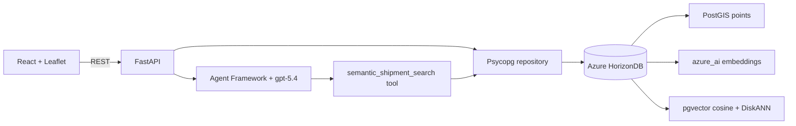

# HorizonShip

HorizonShip is a complete shipping operations sample built with FastAPI,
Psycopg 3, React, and Vite. It demonstrates four Azure HorizonDB capabilities
in one workflow:

- PostGIS stores origin, destination, and current shipment positions as SRID
  4326 points and serves them to a Leaflet world map.
- Azure OpenAI `text-embedding-3-small` creates 1,536-dimensional vectors from
  shipment descriptions through HorizonDB's `azure_ai` model registry.
- pgvector cosine distance (`<=>`) ranks natural-language shipment searches.
- DiskANN accelerates cosine search with 4-bit spherical quantization and
  advanced filtered-search settings.
- Microsoft Agent Framework runs a `gpt-5.4` shipment assistant whose tool is
  the same Psycopg-backed semantic search used by the API.

The repository includes 24 realistic global shipments. HorizonDB and Azure
OpenAI configuration are required because every semantic search and assistant
answer uses the live cloud services.

## User Interface


## Architecture



The agent never invents shipment data. It must call
`semantic_shipment_search` once, and its answer is returned beside the exact
shipment records produced by that tool. The browser uses those records for
result cards and map filtering.

## Repository Layout

| Path | Purpose |
| --- | --- |
| `backend/app/main.py` | FastAPI application and REST routes |
| `backend/app/agent.py` | Agent Framework client and shipment search tool |
| `backend/app/repository.py` | Async Psycopg, PostGIS projection, and vector search |
| `backend/app/setup_database.py` | Idempotent schema, seed, model, vector, and index setup |
| `database/schema.sql` | HorizonDB extensions and relational/vector schema |
| `frontend/src` | React operations console, Leaflet map, and agent chat |

## Run Locally

HorizonShip has a Python backend and a React frontend. You will run both from
source in two terminals. No prebuilt application is required.

### 1. Install Python and Node.js

#### Windows

1. Download and install [Python for Windows](https://www.python.org/downloads/windows/).
  Choose Python 3.11 or newer and enable **Add Python to PATH** in the
  installer.
2. Download and install the LTS version of
  [Node.js](https://nodejs.org/en/download). Node.js also installs the `npm`
  command used by the frontend.
3. Close and reopen VS Code after both installations finish.

Open **Terminal > New Terminal** in VS Code. The terminal should say
PowerShell. Run these commands one line at a time:

```powershell
py --version
node --version
npm --version
```

#### macOS

1. Download and install [Python for macOS](https://www.python.org/downloads/macos/).
  Choose Python 3.11 or newer and run the downloaded installer package.
2. Download and install the LTS version of
  [Node.js](https://nodejs.org/en/download). Choose the macOS installer.
  Node.js also installs `npm`.
3. Close and reopen VS Code after both installations finish.

Open **Terminal > New Terminal** in VS Code. Run these commands one line at a
time:

```bash
python3 --version
node --version
npm --version
```

For either operating system, Python must be 3.11 or newer and Node.js must be
20.19 or newer. If a command is not found, restart VS Code. If it is still
unavailable, reinstall that tool and make sure its PATH option is enabled.

### 2. Gather the Azure settings

The application requires live Azure services. Have these values ready before
continuing:

- An Azure HorizonDB host, database name, user, and password.
- An Azure OpenAI endpoint and API key.
- Azure OpenAI deployments for `gpt-5.4` and
  `text-embedding-3-small`.

Ask your Azure administrator for any values you do not have. Do not put keys
or passwords in files that will be committed to source control.

### 3. Open the project folder

Download or clone this repository. In VS Code, select **File > Open Folder**
and choose the `hdb-postgis` folder. Then select **Terminal > New Terminal**.
The terminal prompt should end with `hdb-postgis`; the commands below assume
you are in that folder.

### 4. Set up the Python backend

Run the block for your operating system. These commands create a private
Python environment in `backend/.venv`, install the backend packages, and copy
the settings template. You only need to do this once.

#### Windows PowerShell

```powershell
Set-Location backend
py -m venv .venv
.\.venv\Scripts\python -m pip install -e ".[dev]"
Copy-Item .env.example .env
```

#### macOS Terminal

```bash
cd backend
python3 -m venv .venv
./.venv/bin/python -m pip install -e ".[dev]"
cp .env.example .env
```

You do not need to activate the virtual environment. The remaining commands
call the project's private Python installation directly.

### 5. Add the Azure settings

In the VS Code Explorer, open `backend/.env`. Replace the placeholder text on
the right side of each `=` with your Azure values:

```dotenv
AZURE_PG_HOST=your-horizondb-host
AZURE_PG_NAME=your-database-name
AZURE_PG_USER=your-database-user
AZURE_PG_PASSWORD=your-database-password
AZURE_PG_PORT=5432
AZURE_PG_SSLMODE=require

AZURE_OPENAI_ENDPOINT=https://your-resource.openai.azure.com/
AZURE_OPENAI_KEY=your-azure-openai-key
AZURE_OPENAI_DEPLOYMENT=gpt-5.4
AZURE_EMBED_DEPLOYMENT=text-embedding-3-small
```

Keep the connection-pool values already in the file. The `backend/.env` file
is ignored by Git. As an alternative to the individual `AZURE_PG_*` values,
advanced users can set `DATABASE_URL` to a complete PostgreSQL connection
string.

### 6. Prepare the database

Stay in the `backend` folder and run the command for your operating system.

#### Windows PowerShell

```powershell
.\.venv\Scripts\python -m app.setup_database
```

#### macOS Terminal

```bash
./.venv/bin/python -m app.setup_database
```

The first run can take a few minutes. It enables the database extensions,
creates the schema, loads 24 sample shipments, generates embeddings, and
builds the DiskANN index. Wait for this confirmation:

```text
HorizonShip ready: 24 shipments, 24 Azure embeddings, primary DiskANN index: ready
```

You can run the setup command again safely. It updates the database without
duplicating the sample shipments.

### 7. Start the backend

In the same terminal, run the command for your operating system.

#### Windows PowerShell

```powershell
.\.venv\Scripts\python -m app.server
```

#### macOS Terminal

```bash
./.venv/bin/python -m app.server
```

Wait until the terminal says Uvicorn is running on
`http://127.0.0.1:8000`. Leave this terminal open. You can verify the backend
by opening `http://127.0.0.1:8000/docs` in a browser.

### 8. Start the frontend

In VS Code, select **Terminal > New Terminal** to open a second terminal. It
should start in the `hdb-postgis` folder. Run the block for your operating
system.

#### Windows PowerShell

```powershell
Set-Location frontend
npm install
npm run dev
```

#### macOS Terminal

```bash
cd frontend
npm install
npm run dev
```

The `npm install` command downloads the frontend packages. You only need to
run it the first time, or after the packages in `package.json` change. Leave
this second terminal open.

### 9. Open and stop the application

Open `http://127.0.0.1:5173` in a browser. Vite sends `/api` requests to the
backend on port 8000, so both terminals must remain running while you use the
application. Set `VITE_API_URL` only when the API runs at a different address.

To stop HorizonShip, click inside each terminal and press **Ctrl+C**. On
Windows, type `Y` and press **Enter** if PowerShell asks you to confirm.

### 10. Run HorizonShip again later

You do not need to recreate the Python environment, reinstall packages, or
prepare the database each time. Open two terminals in the `hdb-postgis`
folder and run the commands for your operating system.

#### Windows PowerShell

Terminal 1:

```powershell
Set-Location backend
.\.venv\Scripts\python -m app.server
```

Terminal 2:

```powershell
Set-Location frontend
npm run dev
```

#### macOS Terminal

Terminal 1:

```bash
cd backend
./.venv/bin/python -m app.server
```

Terminal 2:

```bash
cd frontend
npm run dev
```

### Common first-run fixes

- If the frontend cannot connect, make sure the backend terminal is still
  running and `http://127.0.0.1:8000/docs` opens successfully.
- If the backend reports missing configuration or authentication failures,
  check the values in `backend/.env` and rerun the database setup command.
- If PowerShell says scripts are disabled when you run `npm`, use `npm.cmd`
  in place of `npm`, such as `npm.cmd run dev`.
- If port 8000 or 5173 is already in use, stop the older backend or frontend
  process with **Ctrl+C**, then run the command again.

## Runtime Requirements

HorizonShip has one runtime configuration: HorizonDB provides PostGIS and
DiskANN search over Azure OpenAI embeddings, and Agent Framework uses
`gpt-5.4` for grounded answers. FastAPI fails at startup when the database
connection or `AZURE_OPENAI_KEY` is missing, when the embedding model is not
registered, when any shipment lacks an Azure embedding, or when the primary
DiskANN index is unavailable.

## Vector Search

The production search path creates the query vector inside HorizonDB and keeps
the distance expression in `ORDER BY ... LIMIT`, which allows DiskANN to serve
the query:

```sql
WITH query_vector AS (
    SELECT azure_openai.create_embeddings(
        'horizonship-embedding',
        'delayed electronics from Asia'
    )::public.vector(1536) AS embedding
)
SELECT
    shipment.shipment_number,
    shipment.title,
    1 - (shipment.embedding <=> query_vector.embedding) AS cosine_similarity
FROM horizon_ship.shipments AS shipment
CROSS JOIN query_vector
WHERE shipment.status = 'delayed'
ORDER BY shipment.embedding <=> query_vector.embedding
LIMIT 5;
```

The primary index uses HorizonDB's spherical quantization preview:

```sql
CREATE INDEX shipments_embedding_diskann_idx
    ON horizon_ship.shipments
    USING diskann (embedding vector_cosine_ops)
    WITH (
        spherical_quantized = true,
        sq_bits = 4,
        sq_training_samples = 25000
    );
```

Filtered requests enable DiskANN strict iterative search and the filter hook in
a transaction-local scope before executing the query.

## API

| Method | Route | Purpose |
| --- | --- | --- |
| `GET` | `/api/health` | Database, extension, embedding, and agent readiness |
| `GET` | `/api/shipments` | List shipments with optional status/text filters |
| `GET` | `/api/shipments/stats` | Fleet counts by status |
| `GET` | `/api/shipments/{number}` | Shipment details and PostGIS coordinates |
| `POST` | `/api/search` | Direct cosine vector search |
| `POST` | `/api/chat` | Agent Framework answer plus grounded shipment rows |

## Optional Validation

To run the automated checks, first open a terminal in the `backend` folder.

Windows PowerShell:

```powershell
.\.venv\Scripts\python -m pytest -q
.\.venv\Scripts\python -m ruff check app tests
```

macOS Terminal:

```bash
./.venv/bin/python -m pytest -q
./.venv/bin/python -m ruff check app tests
```

Then open a terminal in the `frontend` folder. These commands are the same on
Windows and macOS:

```bash
npm run build
npm run lint
```

The application does not require a frontend environment file for the default
local development ports.