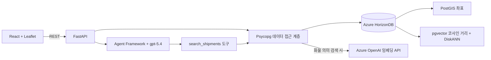

# HorizonShip

HorizonShip은 배송 현황 조회, 지도 표시, 자연어 검색을 함께 구현한 샘플 애플리케이션입니다.
백엔드는 FastAPI로 API를 처리하고 Psycopg 3로 Azure HorizonDB에 연결합니다.
프론트엔드는 React로 화면을 구성하며, Vite를 개발 서버와 빌드 도구로 사용합니다.

배송 조회 흐름에서 다음 기능을 확인할 수 있습니다.

- PostGIS는 출발지, 도착지, 현재 배송 위치를 SRID 4326의 Point로 저장합니다.
  화면은 이 좌표를 Leaflet 세계 지도에 표시하며, 반경 검색은 `ST_DWithin`으로 검사합니다.
- Azure OpenAI의 `text-embedding-3-small`은 화물명·설명·지명·상태·metadata를 합친 텍스트를 1,536차원 벡터로 변환합니다.
  백엔드에서 Entra ID 또는 외부 리소스의 API key로 호출하고, 생성한 벡터를 HorizonDB에 저장합니다.
- pgvector의 코사인 거리 연산자(`<=>`)로 자연어 검색 결과의 순서를 정합니다.
- DiskANN 인덱스는 가까운 벡터 후보를 빠르게 찾습니다.
  이 샘플은 4-bit spherical quantization과 필터 검색 설정을 적용합니다.
- Microsoft Agent Framework는 `gpt-5.4` 기반 배송 어시스턴트를 실행합니다.
  어시스턴트는 정확한 조건을 SQL·PostGIS로 검사하고, 화물의 의미를 찾을 때만 벡터 검색을 추가합니다.

저장소에는 실제 배송 상황을 가정한 전 세계 배송 샘플 24건이 포함되어 있습니다.
의미 검색과 어시스턴트 응답은 실제 클라우드 서비스를 호출하므로 HorizonDB와 Azure OpenAI 설정이 필요합니다.

## 사용자 화면


## 아키텍처



어시스턴트는 배송 데이터를 임의로 생성하지 않고 조회 결과를 바탕으로 답하도록 구성되어 있습니다.
지원하는 조건이면 `search_shipments`를 한 번 호출하며, API는 답변과 함께 도구가 반환한 배송 레코드를 그대로 전달합니다.
지원하지 않거나 모호한 조건은 검색하지 않고 확인 질문을 하도록 지시합니다. 이전 대화 내역은 서버에 전달하지 않으므로
확인 후에는 필요한 조건을 포함한 완전한 질문으로 다시 요청합니다.
브라우저는 이 레코드로 검색 결과 카드를 표시하고 지도에 표시할 배송을 필터링합니다.

### 조건 검색과 의미 검색

| 질문 예시 | 처리 방식 | 검색어 임베딩 호출 |
| --- | --- | --- |
| 지연된 배송 | SQL의 상태 일치 | 없음 |
| 아시아권이 출발지인 배송 | 출발 좌표와 아시아 경계의 PostGIS `ST_Covers` 검사 | 없음 |
| 부산 반경 100km 이내에서 출발한 배송 | 출발 좌표의 PostGIS 거리 검사 | 없음 |
| 의료기관에 필요한 화물 | 화물 검색어의 벡터 유사도 정렬 | 있음 |
| 아시아에서 출발한 의료용품 | 출발 좌표의 PostGIS 영역 조건 + 화물 벡터 검색 | 있음 |

화면에는 실제 검색 방식, 적용 조건, 표시 건수를 보여줍니다. 요청당 최대 8건을 표시하고,
결과가 더 있으면 `has_more`로 알립니다. 전체 조회나 페이지 이동 기능은 아직 없습니다.
SQL·GIS 검색 결과에는 유사도 대신 `조건 일치`를 표시합니다. 화물 의미 검색은 관련성 순위이며
품목 분류의 정확한 일치를 보장하지 않습니다. 조건에 맞는 결과가 없더라도 조건을 풀거나 재검색하지 않습니다.
화면에서 선택한 상태 필터는 질문에서 추론한 상태보다 우선합니다.

AI 결과 카드의 본문을 누르면 배송을 선택하고 상세를 표시합니다. `현재 위치 보기`는 현재 마커로
지도를 이동·확대하고 팝업을 엽니다. 같은 버튼을 다시 누르면 다시 해당 위치로 이동합니다.
선택은 검색 결과와 별도로 관리하므로 이전 대화의 배송이나 좌측 필터에 가려진 배송도 확인할 수 있습니다.
이때 필터는 그대로 두고 지도에 선택 배송 한 건만 임시로 추가하며 `현재 검색 결과 외 배송`을 표시합니다.
상세를 닫으면 임시 마커를 제거하고, 위치 보기로 이동한 경우 기존 결과 범위로 돌아옵니다.
새 AI 검색이 완료되면 이전 선택을 해제합니다. 모바일에서는 카드 선택과 위치 보기 모두 지도 탭을 엽니다.

권역은 DB의 `horizon_ship.region_boundaries`에 SRID 4326 MultiPolygon으로 저장합니다.
[경계 적재 코드](backend/app/region_boundaries.py)는 Natural Earth v5.1.2의 1:50m 국가 경계를
`CONTINENT` 속성별로 합칩니다. 출발 권역은 `ST_Covers(region.boundary, s.origin_position)`,
도착 권역은 `ST_Covers(region.boundary, s.destination_position)`으로 검사하므로 도시명이나
기존 `metadata.regions`와 관계없이 좌표로 판정합니다. 영역 경계 위의 점도 포함합니다.

이 분류는 물리적인 대륙 경계를 국가 내부에서 나누지 않습니다. 튀르키예 전체와 이스탄불은 아시아,
러시아 전체는 유럽입니다. 이전 도시명 목록과 이스탄불 분류가 달라집니다.
중동은 바레인·키프로스·이집트·이란·이라크·이스라엘·요르단·쿠웨이트·레바논·오만·팔레스타인·카타르·
사우디아라비아·시리아·튀르키예·아랍에미리트·예멘의 국가 경계를 합친 별도 데모용 분류입니다.
중동의 이집트는 아프리카에도 포함되며, 중동 전체가 아시아의 부분집합인 것은 아닙니다.

[번들 경계 데이터](database/region_boundaries.json)는 필요한 속성과 좌표만 남긴 약 2.15MB의 JSON이며,
원본 URL·SHA-256·국가별 분류를 포함합니다. Natural Earth 데이터는
[public domain](https://www.naturalearthdata.com/about/terms-of-use/)입니다.
데이터의 경계 표현을 지리·정치적 입장이나 항만 운영 구역의 정의로 해석하지 않습니다.
단순화된 육지 경계에 보정 거리를 더하지 않으므로 해안 밖 부두·섬·해상 좌표가 제외될 수 있습니다.
현재 샘플의 코펜하겐·이스탄불·뉴욕 좌표는 이 경계 밖으로 판정됩니다. 튀르키예의 분류가 아시아여도
이스탄불 샘플 좌표가 아시아 검색에 포함되는 것은 아닙니다. 도시명으로 보완하거나 결과를 강제로 포함하지 않습니다.
실행 중에는 원본 파일을 다운로드하거나 경계 전체를 AI·브라우저로 전송하지 않습니다.

특정 장소명과 반경 기준점은 [backend/app/search_locations.py](backend/app/search_locations.py)의
샘플 도시 목록을 계속 사용합니다. 새 도시를 반경 중심점이나 장소명 조건으로 조회하려면 목록에 추가합니다.
지원하지 않는 국가·날짜·제외 조건 등을 벡터 검색으로 대신 처리하지 않도록 Agent에 지시합니다.

반경은 등록된 도시 좌표를 중심으로 `geography` 거리(미터)로 검사합니다. 항로 거리나 항만 경계 검사가 아닙니다.
경계 테이블만 추가하며 기존 배송 데이터·임베딩은 그대로 유지합니다. 데이터가 커지면
출발지·도착지 geometry GiST 인덱스와 `geography` 표현식 GiST 인덱스를 실행 계획에 맞게 추가해야 합니다.
기존 geometry 인덱스가 geography 형변환 검색에도 사용된다고 가정하지 않습니다.

`POST /api/search`는 기존의 벡터 검색 직접 호출 API로 유지합니다. `/api/chat`만 구조화 조건 도구를 사용합니다.
응답의 `search_mode`는 `sql`, `gis`, `diskann_cosine`, `hybrid` 중 하나이며, 확인 질문은 `not_searched`입니다.
`diskann_cosine`이나 `hybrid`는 검색 경로 이름이며 실제 DiskANN Index Scan 실행을 보장하지 않습니다.
앱 시작 시 일곱 권역의 적재 여부와 기존 벡터 준비 상태를 검사합니다.
SQL 검색만 사용하더라도 초기 DB·임베딩 준비는 필요합니다.

### 데모 실행 내역

대화창은 `POST /api/chat/stream`의 NDJSON 이벤트를 받아 실제 진행 단계와 경과시간을 표시합니다.
요청 접수, Agent 조건 해석, 조건 확정, 선택적인 임베딩 호출, DB 연결, SQL 실행·결과 수신,
답변 작성 순서로 기록하며, 완료·실패·중단 후에도 해당 답변의 `실행 내역`에서 다시 확인할 수 있습니다.
답변 본문은 완성 후 한 번에 전달합니다. 모델의 내부 추론이나 토큰 단위 응답 스트리밍은 표시하지 않습니다.

임베딩 단계의 `임베딩 API 입력 검색어`는 벡터 변환 전에 실제 API로 보내는 `cargo_query` 문자열입니다.
사용자 질문 전체가 아니라 Agent가 추출한 화물 검색어이며 원문 그대로 표시합니다. 상태·권역 조건만 있는
검색에서는 임베딩 단계가 나타나지 않습니다. SQL·바인딩 값은 Repository가 Psycopg에 전달하는 내용이며,
문자열을 끼워 넣은 실행 SQL을 임의로 만들지 않습니다. 바인딩 값은 `%s` 순서대로 표시하되 벡터 숫자는
`[vector: 1536 dimensions; omitted]`로 대체합니다.
DiskANN 공통 설정 6개는 연결 풀의 `configure` 콜백에서 새 연결마다 한 번 적용합니다.
`SET SESSION` 문을 묶어 전송하고 초기화 트랜잭션을 커밋하므로 이후 요청에서도 유지됩니다.
풀 확장·재연결 시에도 같은 설정이 적용되며 서버·DB 전체 기본값은 변경하지 않습니다.
검색 요청마다 설정 SQL을 반복하거나 진행 내역에 설정 단계를 표시하지 않습니다.
초기화가 실패한 연결은 풀에서 사용할 수 없으며, 시작 시 연결 준비도 실패할 수 있습니다.

SQL 이벤트는 실행 직전에 전송되므로 그 자체가 성공을 뜻하지 않습니다. 뒤의 DB 결과 수신 이벤트로 성공을
구분합니다. DB 조회 시간은 execute와 fetch 시간이며 서버 전용 실행 시간이나 실행 계획은 아닙니다.
트랜잭션 시작·종료와 풀 내부의 SQL까지 추적하는 DB 감사 로그는 아닙니다.
DB 수신 행 수에는 추가 결과 확인용 한 행이 포함될 수 있어 화면 전달 건수와 다를 수 있습니다.

요청별 이벤트에는 요청 ID·순번·서버 경과시간이 포함됩니다. 10초간 새 이벤트가 없으면 heartbeat를 보내고,
서버는 120초, 브라우저는 150초에 timeout을 처리합니다. 중단 버튼·연결 종료는 해당 요청의 비동기 작업을
취소하며, 이미 외부 서비스에서 처리 중인 모델 호출의 비용까지 취소되는 것을 보장하지는 않습니다.
스트림의 오류는 최종 error 이벤트로 전달하고, 클라이언트는 최종 result 없이 연결이 끝난 경우도 실패로 처리합니다.

이 기능은 로컬 데모용이며 SQL 스키마와 검색 조건을 브라우저에 노출합니다. 키·접속 문자열·전체 벡터·예외
원문은 이벤트에 포함하지 않지만, 검색어와 조건에는 업무 데이터가 포함될 수 있습니다. 현재 API에는 인증이
없으므로 운영 환경에 그대로 공개하지 마세요. 운영 적용 시 사용자 인증·접근 권한·추가 마스킹을 적용하거나
추적 endpoint를 비활성화하고 기존 `/api/chat`을 사용합니다. 프록시는 응답 버퍼링을 끄고 스트림 timeout을
맞춰야 합니다. 실행 내역은 브라우저 메모리에만 있으며 새로고침·대화 초기화 시 사라집니다.

## 저장소 구조

| 경로 | 역할 |
| --- | --- |
| [backend/app/main.py](backend/app/main.py) | FastAPI 애플리케이션과 REST 경로 |
| [backend/app/agent.py](backend/app/agent.py) | Agent Framework 클라이언트와 배송 검색 도구 |
| [backend/app/repository.py](backend/app/repository.py) | 비동기 Psycopg 연결, PostGIS 좌표 조회, 벡터 검색 |
| [backend/app/setup_database.py](backend/app/setup_database.py) | 반복 실행 가능한 스키마, 샘플 데이터, 벡터, 인덱스 설정 |
| [backend/app/embeddings.py](backend/app/embeddings.py) | Entra ID·API key 인증, endpoint 정규화, 임베딩 응답 검사 |
| [database/schema.sql](database/schema.sql) | HorizonDB 확장 기능과 관계형·벡터 스키마 |
| [frontend/src](frontend/src) | React 운영 화면, Leaflet 지도, 어시스턴트 채팅 |

## 로컬 실행

Python 백엔드와 React 프론트엔드를 각각 별도 터미널에서 소스로 실행합니다.
미리 빌드한 애플리케이션은 필요하지 않습니다.
백엔드의 Python 설치, 가상환경, 패키지는 [uv](https://docs.astral.sh/uv/)로 관리합니다.

### 1. uv와 Node.js 설치

#### Windows

PowerShell에서 다음 명령으로 uv를 설치합니다.

```powershell
winget install --id=astral-sh.uv -e
```

WinGet을 사용할 수 없다면 [uv 공식 설치 안내](https://docs.astral.sh/uv/getting-started/installation/)에서
Windows용 설치 방법을 확인합니다.
[Node.js](https://nodejs.org/en/download)는 LTS 버전의 Windows 설치 파일로 설치합니다.
프론트엔드에서 사용할 `npm`도 함께 설치됩니다.

#### macOS

터미널에서 uv 공식 설치 스크립트를 실행합니다.

```bash
curl -LsSf https://astral.sh/uv/install.sh | sh
```

[Node.js](https://nodejs.org/en/download)는 LTS 버전의 macOS 설치 파일로 설치합니다.
`npm`도 함께 설치됩니다.

#### 설치 확인과 Python 준비

설치를 마치면 VS Code를 닫았다가 다시 엽니다.
**Terminal > New Terminal**에서 새 터미널을 열고 다음 명령을 한 줄씩 실행합니다.
Windows와 macOS에서 같은 명령을 사용합니다.

```bash
uv --version
node --version
npm --version
uv python install 3.11
```

백엔드는 Python 3.11 이상이 필요하며, 이 안내에서는 3.11을 사용합니다.
Node.js는 20.19 이상이 필요합니다. 명령을 찾을 수 없으면 VS Code를 다시 시작하고,
계속 실행되지 않으면 해당 도구의 설치 상태와 PATH 설정을 확인합니다.

### 2. Azure 연결 정보 준비

Azure 리소스가 없다면 [인프라 배포 안내](infra/README.md)에 따라 West US 3에
HorizonDB를 배포합니다. Foundry와 두 모델은 별도 스크립트로 선택 배포하며, 기존 Foundry의 모델을
사용하면 이 단계를 생략합니다. 새 Foundry는 Entra ID 인증만 허용합니다. 등록과 배포는 별도 단계이며,
배포 시 비용이 발생합니다.

애플리케이션은 실제 Azure 서비스를 사용합니다. 다음 정보를 미리 준비합니다.

- Azure HorizonDB 호스트, 데이터베이스 이름, 사용자 이름, 비밀번호
- Azure OpenAI endpoint와 인증 정보(API 키 또는 Entra ID)
- Azure OpenAI의 `gpt-5.4`, `text-embedding-3-small` deployment

모르는 값은 Azure 관리자에게 확인합니다. 키나 비밀번호를 Git에 커밋할 파일에 넣지 마세요.

### 3. 프로젝트 폴더 열기

저장소를 다운로드하거나 clone한 뒤, VS Code의 **File > Open Folder**에서
`horizon-ship` 폴더를 엽니다. 폴더 이름이 다르다면 이 README가 있는 최상위 폴더를 선택합니다.
**Terminal > New Terminal**로 터미널을 열고 현재 위치가 프로젝트 최상위 폴더인지 확인합니다.

### 4. 백엔드 환경 구성

운영체제에 맞는 명령을 실행합니다. `uv sync`는 백엔드 폴더에 `.venv` 가상환경을 만들고
애플리케이션과 개발 도구를 설치합니다. 환경 구성과 설정 파일 복사는 처음 한 번만 하면 됩니다.

#### Windows PowerShell

```powershell
Set-Location backend
uv sync --python 3.11 --extra dev
if (-not (Test-Path .env)) { Copy-Item .env.example .env }
```

#### macOS Terminal

```bash
cd backend
uv sync --python 3.11 --extra dev
test -f .env || cp .env.example .env
```

설정 파일이 이미 있으면 복사하지 않아 기존 연결 정보를 유지합니다.
가상환경을 직접 활성화할 필요는 없습니다. 이후 명령은 `uv run`으로 실행합니다.

현재 [backend/pyproject.toml](backend/pyproject.toml)은 개발 도구를 dependency group이 아닌
`dev` extra로 정의하므로 `--extra dev`를 지정합니다.
기존 패키지 설정이나 Hatchling 빌드 구성을 바꾸지 않고 사용할 수 있습니다.

처음 동기화하면 백엔드 폴더에 `uv.lock`이 생성됩니다.
팀에서 같은 의존성 버전을 사용하려면 이 lockfile도 Git으로 관리하는 것을 권장합니다.
가상환경과 비밀 값이 담긴 설정 파일은 Git에 추가하지 않습니다.

### 5. Azure 연결 정보 입력

VS Code 탐색기에서 백엔드 폴더의 `.env` 파일을 엽니다.
각 `=` 오른쪽의 예시 값을 준비한 Azure 연결 정보로 바꿉니다.

```dotenv
AZURE_PG_HOST=your-horizondb-host
AZURE_PG_NAME=your-database-name
AZURE_PG_USER=your-database-user
AZURE_PG_PASSWORD=your-database-password
AZURE_PG_PORT=5432
AZURE_PG_SSLMODE=require

AZURE_OPENAI_ENDPOINT=https://your-resource.openai.azure.com/
AZURE_OPENAI_KEY=
AZURE_OPENAI_DEPLOYMENT=gpt-5.4
AZURE_EMBED_DEPLOYMENT=text-embedding-3-small
```

`AZURE_OPENAI_KEY`가 비어 있으면 채팅과 임베딩 모두 Entra ID로 인증합니다.
이 저장소의 Foundry 배포 스크립트는 `disableLocalAuth: true`로 key 인증을 차단하므로 빈 값을 유지합니다.

기존 외부 Foundry에서 key 인증을 허용한다면 로컬 설정의 `AZURE_OPENAI_KEY`에 유효한 key를 입력합니다.
key가 있으면 채팅과 임베딩 모두 해당 key를 사용하며 Entra ID로 자동 재시도하지 않습니다.
배포 스크립트는 외부 Foundry를 수정하거나 key를 조회하지 않습니다. 노출된 key는 폐기·재발급하고,
채팅·소스·로그에는 넣지 마세요.

| 구성 | 인증 방식 | 사전 준비 |
| --- | --- | --- |
| 새로 배포한 Foundry 또는 key를 사용하지 않는 기존 Foundry | 백엔드의 `DefaultAzureCredential` | 로컬 `az login` 또는 백엔드 Managed Identity와 모델 호출 RBAC |
| key 인증을 허용하는 외부 Foundry | 백엔드의 API key 인증 | 외부 리소스의 endpoint, 유효한 key, 두 모델의 실제 deployment 이름 |

로컬 개발에서는 앱을 실행할 계정으로 `az login`을 수행합니다. `DefaultAzureCredential`은
환경 변수, Managed Identity, Azure CLI 등 지원되는 자격 증명을 순서대로 검사하므로,
다른 서비스 주체의 환경 변수가 설정되어 있다면 CLI 계정보다 먼저 선택될 수 있습니다.
SDK가 토큰 획득과 갱신을 처리하며, 액세스 토큰을 설정 파일에 저장할 필요는 없습니다.

Entra ID를 사용하는 백엔드 계정에 **부모 Foundry 리소스 범위**의
`Cognitive Services OpenAI User` 역할 등 모델 호출 권한이 필요합니다.
Project 범위 권한이나 리소스 관리용 Contributor 권한만으로 모델 호출 권한을 대신할 수는 없습니다.
권한 변경 직후에는 반영에 시간이 걸릴 수 있습니다.

DB는 Foundry를 직접 호출하지 않습니다. DB 모델 레지스트리 등록, DB Identity와 Foundry 호출용 DB RBAC는
앱 실행에 필요하지 않으며 key나 토큰을 DB에 저장하지 않습니다. 이전 버전이 만든 모델 등록과 Identity는
자동 삭제하지 않으므로, 다른 용도가 없는지 확인한 뒤 별도로 정리합니다.
2026-09-10 검증에서 `azure_ai` 2.2.2의 BYOM Managed Identity 인증이 미지원 오류를 반환했으며,
현재 구조는 이 경로를 사용하지 않습니다.

`AZURE_OPENAI_ENDPOINT`는 `https://<resource>.openai.azure.com/` 또는
`https://<resource>.services.ai.azure.com/` 형식의 리소스 주소를 사용합니다.
포털에서 복사한 `/openai/v1/responses` 또는 `/openai/v1/embeddings` 주소도 받으며 SDK용 주소로 정규화합니다.
`/api/projects/...` 형식의 project endpoint는 사용하지 않습니다. 임베딩은 OpenAI v1 API를 호출합니다.
채팅·임베딩 deployment는 같은 리소스 안에 있어야 하며, 외부 리소스에서 이름을 바꿔 배포했다면 환경 변수도 맞춥니다.
key 인증 여부와 관계없이 백엔드에서 해당 endpoint에 네트워크로 접근할 수 있어야 합니다.
DB 접속 인증은 별개이므로 기존 PostgreSQL 사용자 이름과 비밀번호가 필요합니다.

파일에 있는 연결 풀 설정은 그대로 둡니다. 백엔드의 `.env` 파일은 Git 추적 대상에서 제외되어 있습니다.
개별 `AZURE_PG_*` 값 대신 `DATABASE_URL`에 전체 PostgreSQL 연결 문자열을 지정해도 됩니다.

### 6. 데이터베이스 준비

#### 확장 허용 목록 확인

먼저 대상 DB에 접속해 다음 SQL을 실행합니다. VS Code의 PostgreSQL 확장이나 PostgreSQL 클라이언트를 사용하면 됩니다.

```sql
SHOW azure.extensions;
```

허용 목록에 `vector`, `pg_diskann`, `postgis`, `uuid-ossp`가 모두 있어야 합니다.
목록이 비어 있거나 필요한 항목이 빠졌다면, HorizonDB에 연결할 parameter group의
`azure.extensions` 값에 다음 항목을 포함하도록 구성합니다. 기존에 허용한 다른 확장은 유지합니다.

```text
vector,pg_diskann,postgis,uuid-ossp
```

Parameter group 생성·연결과 적용 상태 확인은
[HorizonDB 확장 허용 안내](https://learn.microsoft.com/en-us/azure/horizondb/extensions/how-to-allow-extensions)를 따릅니다.
적용 후 DB에 다시 접속해 `SHOW azure.extensions;` 결과를 확인합니다.
이 설정만을 위해 전체 인프라를 재배포하지 말고, 대상 클러스터의 parameter group과 다른 설정에 미치는 영향을 먼저 확인합니다.
인프라 템플릿은 기존 설정과의 호환성을 위해 `azure_ai` 허용 항목도 유지하지만 앱은 이를 설치하거나 호출하지 않습니다.

**서버의 확장 허용과 DB의 확장 설치는 별도 단계입니다.**
[데이터베이스 준비 코드](backend/app/setup_database.py)는
[스키마 SQL](database/schema.sql)의 `CREATE EXTENSION`을 실행하지만,
서버의 `azure.extensions` 허용 목록이나 parameter group 연결은 변경하지 않습니다.
인프라 템플릿을 배포했더라도 대상 클러스터에 설정이 실제로 적용됐는지 확인해야 합니다.

#### 스키마와 샘플 데이터 생성

확장 허용 목록과 5단계의 백엔드 모델 호출 인증을 준비한 뒤,
`backend` 폴더에서 다음 명령을 실행합니다. Windows와 macOS에서 같습니다.

```bash
uv run python -m app.setup_database
```

첫 실행은 몇 분 걸릴 수 있습니다. 허용된 확장을 대상 DB에 설치하고 스키마를 만든 뒤,
번들 경계 일곱 개를 적재하고 배송 샘플 24건과 임베딩을 생성한 뒤 DiskANN 인덱스를 구성합니다.
다음 메시지가 나올 때까지 기다립니다.

```text
HorizonShip ready: 24 shipments, 24 Azure embeddings, primary DiskANN index: ready
```

이 명령은 다시 실행해도 샘플 배송을 중복 생성하지 않고 데이터베이스를 갱신합니다.
임베딩 endpoint·deployment·차원을 DB의 `embedding_configuration`에 저장하고,
설정 변경 또는 배송 검색 대상 텍스트 변경 시 벡터를 다시 생성합니다. 인증 방식이나 key 변경만으로는 재생성하지 않습니다.
같은 deployment 이름의 실제 모델을 교체했다면 `uv run python -m app.setup_database --force-embeddings`를 실행합니다.
이전 DB 모델 레지스트리 방식에서 처음 전환할 때도 준비 명령을 다시 실행해야 합니다.
배치 응답 개수·순서·차원을 검사하며, 실패하면 DB 트랜잭션을 롤백합니다. 이미 호출한 모델의 비용은 되돌릴 수 없습니다.

기존 DB에 경계만 추가하거나 다시 적재할 때는 `backend` 폴더에서 아래 명령을 실행합니다.
배송·임베딩·DiskANN 인덱스를 갱신하지 않고 경계 테이블만 트랜잭션으로 갱신합니다.
이후 백엔드를 재시작합니다. JSON-C가 없는 PostGIS 빌드도 사용할 수 있도록 Shapely로 WKB를 만들어 전달합니다.

```bash
uv run python -m app.region_boundaries
```

원본을 다시 받을 때만 `uv run python -m app.region_boundaries --download`를 실행합니다.
고정 버전 URL에서 번들 JSON을 재생성하는 명령이며 DB 적재는 별도로 실행해야 합니다.

### 7. 백엔드 실행

같은 터미널에서 다음 명령을 실행합니다.

```bash
uv run python -m app.server
```

Uvicorn이 `http://127.0.0.1:8000`에서 실행 중이라는 메시지가 나오면 터미널을 그대로 둡니다.
브라우저에서 `http://127.0.0.1:8000/docs`를 열어 백엔드 실행 상태를 확인할 수 있습니다.

### 8. 프론트엔드 실행

VS Code의 **Terminal > New Terminal**에서 두 번째 터미널을 엽니다.
현재 위치가 `horizon-ship` 최상위 폴더인지 확인한 뒤 운영체제에 맞는 명령을 실행합니다.

#### Windows PowerShell

```powershell
Set-Location frontend
npm install
npm run dev
```

#### macOS Terminal

```bash
cd frontend
npm install
npm run dev
```

`npm install`은 프론트엔드 패키지를 설치합니다. 처음 실행하거나
[frontend/package.json](frontend/package.json)의 패키지가 바뀌었을 때 실행하면 됩니다.
이 터미널도 그대로 둡니다.

### 9. 애플리케이션 접속과 종료

브라우저에서 `http://127.0.0.1:5173`을 엽니다.
Vite 개발 서버는 `/api` 요청을 8000번 포트의 백엔드로 전달하므로 두 터미널 모두 실행 중이어야 합니다.
API를 다른 주소에서 실행할 때만 `VITE_API_URL`을 설정합니다.

종료할 때는 각 터미널에서 **Ctrl+C**를 누릅니다.
Windows에서 종료 확인을 요청하면 `Y`를 입력하고 **Enter**를 누릅니다.

### 10. 다음에 다시 실행하기

매번 가상환경을 만들거나 데이터베이스를 준비할 필요는 없습니다.
`horizon-ship` 최상위 폴더에서 터미널 두 개를 열고 다음 명령을 실행합니다.
`uv run`은 실행 전에 의존성 설정과 가상환경을 확인하고 필요한 변경을 반영합니다.

#### Windows PowerShell

터미널 1:

```powershell
Set-Location backend
uv run python -m app.server
```

터미널 2:

```powershell
Set-Location frontend
npm run dev
```

#### macOS Terminal

터미널 1:

```bash
cd backend
uv run python -m app.server
```

터미널 2:

```bash
cd frontend
npm run dev
```

### 처음 실행할 때 자주 겪는 문제

- 프론트엔드가 연결되지 않으면 백엔드 터미널이 실행 중인지 확인하고
  `http://127.0.0.1:8000/docs`에 접속해 봅니다.
- 백엔드에서 설정 누락이나 인증 오류가 발생하면 백엔드의 `.env` 값을 확인한 뒤
  데이터베이스 준비 명령을 다시 실행합니다.
- `uv`를 찾을 수 없으면 VS Code를 다시 시작하고 PATH 설정을 확인합니다.
- PowerShell에서 `npm` 실행 시 스크립트 실행이 제한되면 `npm.cmd run dev`처럼
  `npm` 대신 `npm.cmd`를 사용합니다.
- 8000번 또는 5173번 포트를 이미 사용 중이면 기존 백엔드나 프론트엔드 터미널에서
  **Ctrl+C**로 해당 프로세스를 종료한 뒤 다시 실행합니다.

## 실행에 필요한 조건

HorizonShip은 실제 클라우드 서비스에 연결하는 구성으로 동작합니다.
HorizonDB는 PostGIS 좌표와 Azure OpenAI 임베딩을 저장하고 DiskANN 인덱스로 벡터 검색을 가속합니다.
Agent Framework는 `gpt-5.4`로 조회 결과에 근거한 답변을 생성합니다.

데이터베이스 연결 설정이나 `AZURE_OPENAI_ENDPOINT`가 없으면 FastAPI 시작이 실패합니다.
`AZURE_OPENAI_KEY`가 없으면 백엔드의 채팅과 임베딩 모두 Entra ID를 사용합니다.
자격 증명과 권한 오류는 실제 모델 호출 시 발생할 수 있으며, 앱 시작 성공이 인증 성공을 보장하지는 않습니다.
DB에 저장된 임베딩 설정과 백엔드 설정이 다르거나, Azure 임베딩이 없는 배송이 하나라도 있거나,
기본 DiskANN 인덱스를 사용할 수 없어도 시작하지 않습니다.

## 벡터 검색

백엔드가 검색어를 1,536차원 벡터로 변환한 뒤 Psycopg 매개변수로 SQL에 전달합니다.
거리 연산식을 `ORDER BY ... LIMIT`에 유지해 DiskANN 인덱스를 사용할 수 있도록 구성합니다.
실제 인덱스 사용 여부는 데이터베이스의 실행 계획에 따라 달라집니다.

```sql
WITH query_vector AS (
  SELECT %s::public.vector(1536) AS embedding
)
SELECT
    shipment.shipment_number,
    shipment.title,
    1 - (shipment.embedding <=> query_vector.embedding) AS cosine_similarity
FROM horizon_ship.shipments AS shipment
CROSS JOIN query_vector
WHERE shipment.status = 'delayed'
ORDER BY shipment.embedding <=> query_vector.embedding
LIMIT 5;
```

위 SQL의 `%s`는 Psycopg 매개변수 자리입니다. SQL 콘솔에 그대로 실행하는 문장이 아닙니다.

기본 인덱스는 HorizonDB의 spherical quantization 미리 보기 기능을 사용합니다.
이 설정은 벡터를 낮은 비트 수로 압축해 검색 비용을 줄이는 방식입니다.
DiskANN은 근사 최근접 이웃 검색이므로 전체 벡터를 정확히 비교한 결과와 일부 차이가 날 수 있습니다.

```sql
CREATE INDEX shipments_embedding_diskann_idx
    ON horizon_ship.shipments
    USING diskann (embedding vector_cosine_ops)
    WITH (
        spherical_quantized = true,
        sq_bits = 4,
        sq_training_samples = 25000
    );
```

필터가 있는 요청은 쿼리 실행 전에 DiskANN의 strict iterative search와 filter hook을 활성화합니다.
이 설정은 해당 트랜잭션 안에서만 적용됩니다.

## API

| 메서드 | 경로 | 역할 |
| --- | --- | --- |
| `GET` | `/api/health` | 데이터베이스, 확장 기능, 임베딩, 어시스턴트 준비 상태 확인 |
| `GET` | `/api/shipments` | 배송 목록 조회, 선택적으로 상태·텍스트 필터 적용 |
| `GET` | `/api/shipments/stats` | 상태별 배송 건수 조회 |
| `GET` | `/api/shipments/{number}` | 배송 상세 정보와 PostGIS 좌표 조회 |
| `POST` | `/api/search` | 코사인 거리 기반 벡터 검색 직접 실행 |
| `POST` | `/api/chat` | Agent Framework 답변과 근거가 된 배송 레코드 반환 |

## 테스트와 코드 검사

백엔드 검사는 `backend` 폴더에서 실행합니다. Windows와 macOS에서 같은 명령을 사용합니다.
테스트와 코드 검사 도구를 설치하도록 `--extra dev`를 지정합니다.

```bash
uv run --extra dev python -m pytest -q
uv run --extra dev python -m ruff check app tests
```

프론트엔드 검사는 `frontend` 폴더에서 실행합니다. 두 운영체제에서 명령은 같습니다.

```bash
npm run build
npm run lint
```

기본 로컬 개발 포트를 사용한다면 프론트엔드 환경 변수 파일은 필요하지 않습니다.