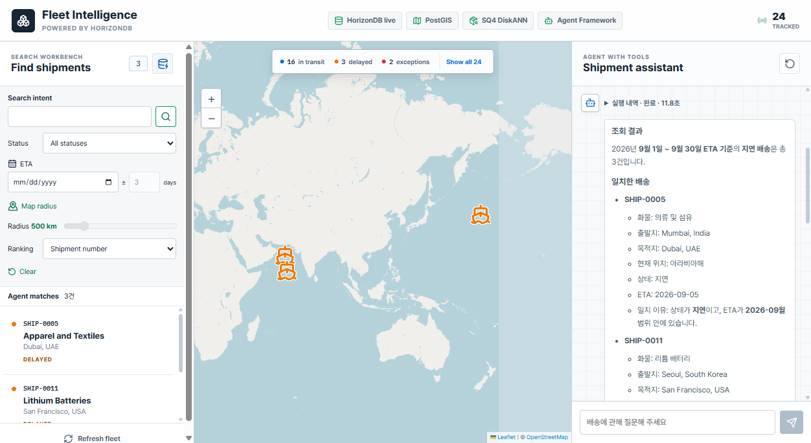
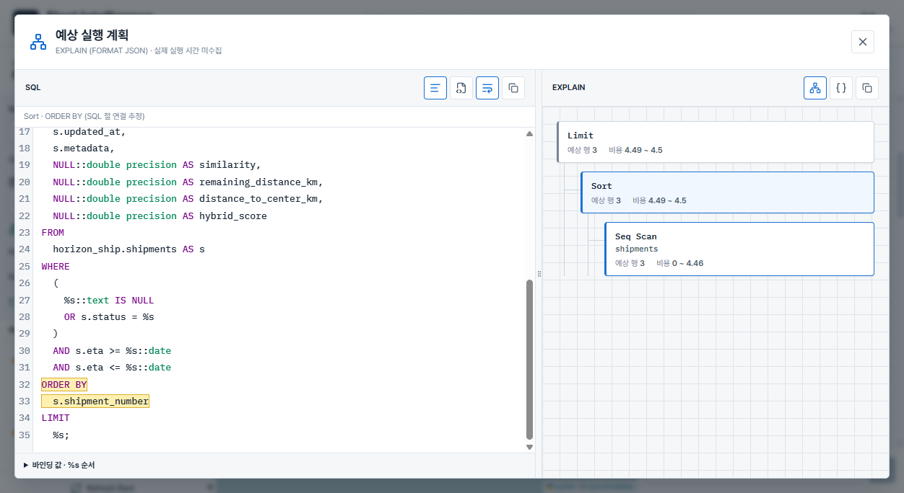

# Fleet Intelligence: HorizonDB에서 조건·공간·의미 검색 함께 사용하기

배송 담당자는 때로 조건을 정확히 알고 있습니다. 지연 상태이고, 일정 기간에 도착 예정이며, 특정 지역 주변에 있는 배송을 찾는 식입니다. 반대로 “의료기관에 필요한 화물”처럼 설명의 의미에서 검색을 시작하기도 합니다. Fleet Intelligence는 이 두 방식을 같은 HorizonDB 데이터에 적용하고, 반환한 배송과 검색 조건을 함께 보여주는 샘플입니다.

이 문서는 [참고 프로젝트](https://github.com/FranckPachot/horizondb-fleet-intelligence)의 시나리오를 바탕으로 HorizonShip의 현재 구현을 설명합니다. 원본을 그대로 번역한 문서는 아닙니다. 제품명과 기술 용어는 영어로 유지하고 API·데이터 구조·검증 범위는 2026-09-15의 로컬 구현에 맞췄습니다. 원문 링크와 라이선스는 [문서 출처와 라이선스](THIRD-PARTY-NOTICES.md)에서 확인할 수 있습니다.


24건의 고정 샘플은 각 조건과 결과를 직접 확인하기 위한 데이터입니다. 실제 운항 관제나 대규모 성능 비교 자료는 아닙니다. 배송·벡터·권역 경계를 같은 DB에 저장하지만, 모델 추론은 외부 Foundry가 수행합니다.

## 두 검색 경로의 역할

Search Workbench는 상태, ETA, 지도 반경을 직접 지정하는 form입니다. `Search intent`는 화물의 의미 검색어이며 상태나 날짜를 자연어로 해석하는 입력이 아닙니다. 검색어가 비어 있으면 임베딩 없이 조건만으로 조회합니다. 입력 변경은 검색 버튼이나 Enter로 적용하고 `Clear`로 초기화합니다.

Agent with Tools는 한국어 질문을 구조화된 조건으로 해석합니다. 모델이 임의 SQL을 작성하는 대신 `ShipmentFilters`에 맞는 인자를 선택하고, Python의 `search_shipments` 도구가 검사한 뒤 Repository를 호출합니다. UI의 배송 카드는 답변 문장에서 다시 추출하지 않고 도구 결과를 그대로 사용합니다.

| 항목 | Search Workbench | Agent with Tools |
| --- | --- | --- |
| API | `POST /api/search/criteria` | `POST /api/chat/stream` |
| 조건 해석 | 컨트롤 값으로 결정 | 모델이 현재 질문을 해석 |
| 모델 호출 | 화물 검색어가 있을 때 임베딩 | 조건 해석·답변 생성, 필요할 때 임베딩 |
| 표시 상한 | 최대 24건 | 현재 화면 최대 8건 |
| 상태 필터 | 선택한 값을 적용 | 화면의 상태 선택이 질문의 상태보다 우선 |
| 이전 입력 | form의 현재 값 | 왼쪽 ETA·반경·검색어와 이전 대화는 자동 전달하지 않음 |

기존 `POST /api/search`는 벡터 검색 직접 호출 API로 남아 있습니다. `/api/chat`은 스트림이 아닌 응답 경로입니다. 원본 문서의 “질문만 보내며 상태를 넣으면 HTTP 422”라는 설명은 이 앱에 적용하지 않습니다.

## 배송과 임베딩을 별도 테이블로 관리

`shipments`에는 업무 필드와 출발지·도착지·현재 위치의 `geometry(Point, 4326)`을 저장합니다. 벡터는 `shipment_embeddings`에서 배송 ID로 연결합니다. `shipment_embedding_jobs`가 의미 필드 변경을 기록하고 기존 `azure_ai on_change` pipeline이 갱신을 처리합니다. 모델 호출 경로를 바꿔도 이 저장 구조와 pipeline을 유지합니다.

초기 setup은 누락된 벡터를 backfill합니다. 이후 검색은 content version을 비교해 작업 중인 새 내용과 오래된 벡터를 혼동하지 않도록 합니다. 초기 설정과 갱신 절차는 [프로젝트 README](../README.md)와 [DB 스키마](../database/schema.sql)를 기준으로 합니다. 시연을 준비한다는 이유로 기존 DB의 전체 setup을 다시 실행하지 않습니다.

권역은 별도의 `region_boundaries`에 MultiPolygon으로 저장합니다. 같은 DB에서 관계형·공간·벡터 조건을 함께 검사하지만 모든 데이터가 하나의 테이블에 있다는 뜻은 아닙니다.

## 질문별로 다른 조건과 정렬

| 예시 | 의도한 조건 | 검색 방식 |
| --- | --- | --- |
| 지연된 배송을 찾아주세요 | `status=delayed` | SQL, 임베딩 없음 |
| 아시아에서 출발한 의료용품을 찾아주세요 | `origin_region=Asia` + `cargo_query` | PostGIS + 의미 검색 |
| 부산 반경 100km 이내에서 출발한 배송을 찾아주세요 | 기준 도시 + `position_field=origin` | `ST_DWithin` |
| 2026년 9월 1일부터 30일까지 도착 예정인 지연 배송을 찾아주세요 | ETA 양 끝 포함 + delayed | SQL, 임베딩 없음 |
| 목적지에 가장 가까운 배송 2개를 찾아주세요 | `sort_by=destination_distance` | 각 배송의 자기 목적지까지 거리순 |
| 싱가포르 반경 5,000km 안의 반도체 관련 배송을 의미 유사도와 현재 위치 거리로 함께 정렬해 주세요 | `sort_by=semantic_spatial`, 현재 위치 반경 + 화물 | 의미·근접도 가중 점수순 |

위 표는 의도한 매핑입니다. 모델 표현은 달라질 수 있으므로 실제 적용 조건과 임베딩 입력은 실행 내역에서 확인합니다. 지원하지 않는 국가 전체 조건, 제외 조건, 등록되지 않은 장소나 모호한 요청은 검색 없이 확인 질문을 하도록 지시합니다. 이어서 요청할 때는 전체 조건을 포함해 다시 질문합니다.

권역·반경·목적지 거리만으로 조회해도 API의 `search_mode`는 `gis`입니다. 의미와 정확한 조건을 함께 사용하면 `hybrid`이며, 이 이름이 가중 정렬이나 실제 DiskANN 사용을 뜻하지는 않습니다. 가중 정렬은 `semantic_spatial`을 명시했을 때만 적용합니다.

## ETA·권역·거리의 의미

ETA는 저장된 도착 예정일입니다. 채팅은 시작일·종료일의 양 끝을 포함하고, Workbench는 중심일 ±일수를 서버에서 계산합니다. 상대 날짜는 `SEARCH_TIMEZONE`의 요청 날짜를 기준으로 해석합니다. 기본 시간대는 `Asia/Seoul`입니다. “이번 주”는 실행 날짜마다 범위가 달라지므로 고정 샘플 발표에서는 절대 날짜가 적합합니다. ETA가 없는 레코드는 날짜 조건에서 제외하며 ETA 순 정렬은 지원하지 않습니다.



2026-09-15 확인한 위 질문은 SHIP-0005, SHIP-0011, SHIP-0020을 반환했습니다. 화물 조건이 없어 임베딩은 생략하지만 조건 해석과 한국어 답변을 위한 채팅 모델 호출은 남습니다. 고정된 처리 시간이나 모든 환경의 결과를 보장하는 수치는 아닙니다.

권역은 Natural Earth v5.1.2의 1:50m 국가 경계를 합쳐 `ST_Covers`로 판정합니다. 경계 위의 점도 포함하지만 해안 밖 부두나 해상 좌표는 제외될 수 있습니다. 현재 샘플의 코펜하겐·이스탄불·뉴욕 좌표는 단순화된 경계 밖으로 판정됩니다. 국가 내부를 물리적 대륙 경계로 나누지 않으며, 중동은 별도의 데모용 국가 집합입니다. 도시 이름으로 결과를 보정하지 않습니다.

반경은 등록된 도시 또는 수동 선택 좌표를 기준으로 `geography`의 미터 거리로 검사합니다. Workbench는 현재 위치에 50~3,000km 반경을 적용합니다. 채팅은 출발·도착·현재 위치를 구분하며, 5,000km 예시는 등록 도시를 사용하는 채팅의 범위입니다. 지도에는 어느 경우든 현재 위치를 표시합니다.

목적지 거리 정렬은 `ST_Distance(current_position::geography, destination_position::geography)`를 사용합니다. 상태를 지정하지 않으면 배송 완료를 제외하고 같은 거리에서는 배송 번호로 정렬합니다. 이 거리는 실제 항로 길이나 도착까지 걸리는 시간이 아닙니다. 화물 의미 검색과 자기 목적지 거리순의 동시 사용은 지원하지 않습니다.

## 의미·근접도 가중 정렬

```text
hybrid_score = 0.72 * cosine_similarity
             + 0.28 * max(0, 1 - distance_to_center_km / radius_km)
```

72:28은 이 샘플의 정렬 정책입니다. 근접도 항은 반경 안에서 기준점에 가까울수록 커지지만 코사인 유사도는 음수도 가능하므로 전체 점수를 0~1 확률로 설명하지 않습니다. 화면의 `cos`는 코사인 유사도, `score`는 이 가중 점수입니다. 화물 의미 검색은 관련성 정렬이지 품목의 정확한 일치 조건이 아니므로 다른 종류의 화물도 결과에 포함될 수 있습니다.

가중 정렬은 조건에 맞는 전체 레코드를 평가한 뒤 LIMIT을 적용합니다. 먼저 코사인 상위 일부만 뽑으면 가까운 배송이 가중 상위 결과에서 누락될 수 있기 때문입니다. 이 선택은 큰 데이터에서 비용을 늘릴 수 있으며 DiskANN의 근사 최근접 탐색 성능을 그대로 기대할 수 없습니다. 일반 의미 검색과 가중 정렬은 같은 접근 경로라고 가정하지 않습니다.

## SQL과 인덱스

모델은 조건만 선택하고 열·정렬식은 서버 코드에서 고릅니다. 조건값은 Psycopg의 `%s`에 바인딩합니다. 다음은 아시아 출발 의료용품 검색을 설명하기 위해 조회 열을 줄인 예시입니다. 실제 SQL은 요청의 실행 내역을 확인합니다.

```sql
WITH query_vector AS (SELECT %s::public.vector(1536) AS embedding)
SELECT s.shipment_number,
       1 - (se.embedding <=> query_vector.embedding) AS similarity
FROM horizon_ship.shipments AS s
JOIN horizon_ship.shipment_embeddings AS se ON se.shipment_id = s.id
LEFT JOIN horizon_ship.shipment_embedding_jobs AS sej ON sej.shipment_id = s.id
CROSS JOIN query_vector
WHERE (%s::text IS NULL OR s.status = %s)
  AND (sej.shipment_id IS NULL OR sej.content_version = se.content_version)
  AND EXISTS (
      SELECT 1 FROM horizon_ship.region_boundaries AS region
      WHERE region.name = %s
        AND public.ST_Covers(region.boundary, s.origin_position)
  )
ORDER BY se.embedding <=> query_vector.embedding
LIMIT %s;
```

기본 벡터 인덱스는 cosine 연산자에 맞춘 DiskANN이며 `spherical_quantized=true`, `sq_bits=4`, `sq_training_samples=25000`을 설정합니다. 25,000은 설정값이지 적재한 배송 수가 아닙니다. 공통 DiskANN 설정 6개는 새 풀 연결의 초기화 단계에서 `SET SESSION`으로 한 번 적용합니다. 매 요청마다 `SET LOCAL`을 실행하지 않습니다.

상태·ETA B-tree와 공간 GiST는 planner의 선택지를 제공합니다. 현재 위치 반경용 `shipments_current_geography_idx`는 `(current_position::geography)` 표현식 인덱스입니다. geometry 인덱스가 이 형변환 검색에도 사용된다고 가정하지 않습니다. 2026-09-15 ETA·geography 인덱스를 추가한 뒤 유효 상태와 배송 24건·벡터 24건·작업 큐 0건의 보존을 확인했습니다. 이 문서 작업에서는 DB를 변경하지 않았습니다.

원본 자료의 특정 BitmapAnd, DiskANNFilteredScan, TID 개수나 실행 시간은 원본 환경의 결과입니다. 현재 조건에서 같은 계획이 반드시 나온다고 설명하지 않습니다. 특히 24건의 작은 데이터에서는 Seq Scan도 합리적인 선택일 수 있습니다.

## 요청별 SQL viewer와 예상 계획



채팅의 실행 내역은 요청 ID·순번·경과시간으로 진행 상태를 기록합니다. 임베딩 직전에 실제 입력 검색어를 표시하고, SQL과 바인딩 값은 실행 직전에 전송합니다. SQL 이벤트가 있다는 사실만으로 조회 성공을 판단하지 않고 뒤의 DB 결과 수신 이벤트를 확인합니다. 답변은 완성 후 한 번에 전달하며 내부 추론이나 토큰별 생성 과정은 노출하지 않습니다.

`CAPTURE_QUERY_PLAN=true`일 때 같은 바인딩 값으로 `EXPLAIN (FORMAT JSON)`을 조회합니다. 검색어 벡터는 먼저 생성한 것을 재사용합니다. `ANALYZE`가 아니므로 검색을 다시 실행해 실제 시간·buffer·WAL을 수집하지 않으며, 계획 조회를 위해 모델을 다시 호출하지 않습니다. 화면의 DB 시간은 execute와 fetch를 포함한 클라이언트 측정값입니다.

CodeMirror SQL viewer는 구문 강조·줄 번호·정돈/원본 보기·줄바꿈을 지원합니다. 복사 버튼은 원본 SQL을 복사하고 바인딩 값은 별도 접이식 영역에 표시합니다. SQL:EXPLAIN의 초기 6:4 비율을 드래그·방향키로 바꾸고 두 번 클릭해 복원합니다. 모바일은 위아래로 배치합니다.

계획 노드를 누르면 PostgreSQL 구문 트리에서 LIMIT·ORDER BY·GROUP BY·테이블 참조 중 유일하게 대응하는 범위를 강조합니다. EXPLAIN에 SQL 원문 위치가 없으므로 추정 연결입니다. 중복된 절, 같은 테이블을 여러 번 참조하는 SQL, 직접 대응하지 않는 optimizer 노드는 임의로 강조하지 않습니다.

벡터 숫자와 노출 위험이 있는 Filter·Output 등은 계획에서 제거합니다. 요청별 이벤트는 브라우저 메모리에 보관하며 전역 last plan을 사용하지 않습니다. 다른 검색 뒤에도 해당 답변의 계획을 확인할 수 있지만, 새로고침이나 대화 초기화로 사라집니다. 팝업을 다시 열거나 크기를 바꾸는 동작은 API를 호출하지 않습니다.

## 모델 호출과 기존 pipeline

`CHAT_PROVIDER`와 `EMBEDDING_PROVIDER`는 각각 `azure_openai`와 `horizondb` 중에서 선택합니다. 기본값은 직접 API 호출입니다. DB provider의 모델 별칭은 `horizonship-chat`, `horizonship-embedding`이며, 채팅은 `azure_ai.generate`, 임베딩은 `azure_openai.create_embeddings`를 호출합니다. 실제 inference는 두 경로 모두 외부 모델 endpoint에서 실행됩니다.

DB 채팅 adapter는 모델의 구조화 응답을 검사하고, 검색 도구를 최대 한 번 호출한 뒤 도구 결과로 한국어 답변을 작성합니다. 확인 질문이면 도구를 실행하지 않습니다. DB 함수가 Python 도구를 실행하는 것은 아니며, JSON 오류나 모델 오류를 다른 provider로 자동 전환하지 않습니다.

배송 변경 후 벡터 갱신은 두 provider 설정과 관계없이 기존 DB pipeline이 처리합니다. 모델 별칭만 준비할 때는 전체 setup 대신 `--models-only` 절차를 사용합니다. DB 경유 모델 요청은 풀 연결을 점유하므로 긴 모델 대기와 DB 연결 수를 함께 검토해야 합니다. 중단 요청이 이미 발생한 외부 모델 비용까지 취소하지는 못합니다.

## 지도·폰트·데모 상태

본문과 제목은 Pretendard를 사용하고 SQL은 고정폭 폰트를 유지했습니다. 초기 예시 발화에는 상태·권역·반경에 더해 ETA, 목적지 거리, 의미·근접도 정렬을 포함했습니다. 데스크톱과 모바일에서 같은 조건을 조회할 수 있습니다.

지도는 상태별 선박 아이콘을 사용합니다. 목록 선택, 팝업, 상세의 배송을 일치시키고 `현재 위치 보기`로 이동합니다. 이전 대화의 배송이 현재 결과에 없으면 선택한 한 건을 지도에 임시로 추가하고 결과 밖 배송임을 알립니다. 출발·현재·도착 연결선은 날짜 변경선에서 나눈 개략 경로이며 실제 항적이 아닙니다.

SHIP-0024의 `unknown`은 위치 갱신 미보고를 가정한 명시적 샘플 상태입니다. API 변환 실패나 지도 렌더링 실패의 대체값이 아닙니다. 데이터와 의미는 [샘플 정의](../backend/app/sample_data.py)를 따릅니다.

## 실행·검증·운영 전 확인

Backend는 uv, frontend는 npm으로 별도 실행합니다. 인프라는 PowerShell·Bicep으로 HorizonDB와 선택적 Foundry를 준비하며 조회 전용 Check, WhatIf, 승인 후 Deploy 순서를 사용합니다. 원본의 `azd up`·Container Apps 배포는 현재 저장소에 없습니다. 환경별 인증과 DB pipeline의 모델 endpoint 요구사항은 [인프라 README](../infra/README.md)를 확인합니다.

2026-09-15의 기존 구현 검증에서는 backend 147개 테스트와 실제 DB 모델·ETA·반경·가중 검색을 확인했습니다. SQL 범위 연결은 별도 6개 테스트가 있으며 frontend 빌드·lint와 실제 브라우저 검사를 수행했습니다. 문서의 캡처는 현재 앱에서 저장한 화면이며 원본의 측정값을 재사용하지 않았습니다. 모델의 모든 표현, 모든 환경의 계획, 운영 성능을 보장하는 검증은 아닙니다.

현재 API는 인증 없는 로컬 데모용입니다. 운영에서는 사용자 인증, 데이터 접근 권한, 검색어·조건의 마스킹, 네트워크와 timeout 정책을 추가해야 합니다. HorizonDB Preview의 지원 리전·구독·모델 가용성도 배포 시 다시 확인합니다. 이 샘플의 목적은 추천 문장만 보여주는 것이 아니라, 어떤 조건으로 어떤 배송을 조회했는지 확인할 수 있는 구현을 제공하는 데 있습니다.

발표용 요약은 [슬라이드](fleet-intelligence-slides.html), 실제 시연 순서는 [발표자 노트](presenter-notes.md), 원본과 개정본 구분은 [문서 안내](README.md)를 참고합니다.