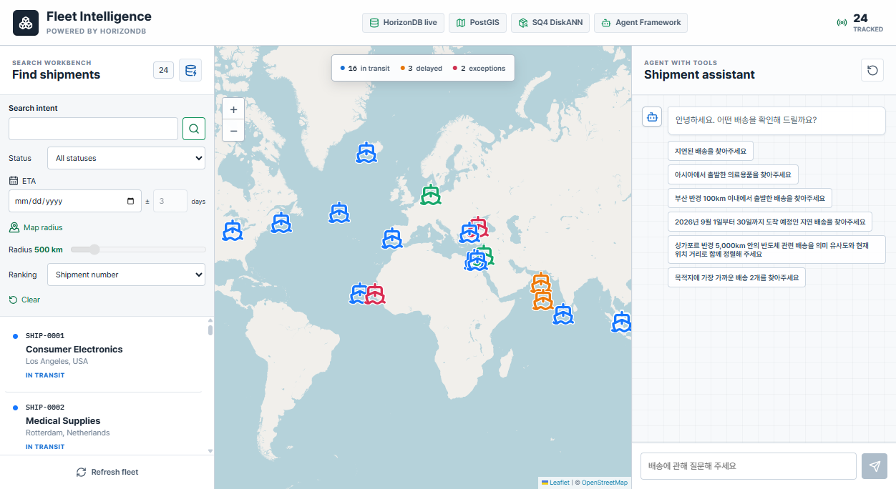

# Fleet Intelligence

## Fleet Intelligence

**Powered by HorizonDB**

배송의 상태·위치·화물 의미를 함께 조회하는 운영 샘플입니다.



PostGIS · pgvector · SQ4 DiskANN · Microsoft Agent Framework

## 하나의 HorizonDB에서 업무 데이터와 AI 검색을 함께

상태와 도착 예정일, 위치와 권역, 화물 설명의 의미를 함께 저장하고 조회합니다. PostgreSQL의 확장 생태계와 Azure의 AI·벡터 검색 기능을 결합하는 샘플입니다.

PostgreSQL 호환 기반 · 관계형 데이터 관리 · 확장 기능

| 데이터 | 함께 조회하는 내용 | 사용하는 기능 |
| --- | --- | --- |
| 정형 데이터 | 배송 상태·ETA·화물 설명 | SQL · B-tree |
| 공간 데이터 | 출발·도착·현재 위치와 권역 | PostGIS · GiST |
| 벡터 데이터 | 화물 설명의 의미와 유사도 | pgvector · SQ4 DiskANN |

업무 데이터 변경 → 임베딩 갱신 pipeline → 벡터 갱신

`azure_ai`로 외부 모델을 호출해 질문을 해석하고 임베딩을 생성합니다. 실제 추론은 Azure AI Foundry에서 실행됩니다.

업무 데이터를 용도별 외부 검색 저장소로 나누지 않고, 하나의 HorizonDB에서 필요한 조건을 함께 조회합니다.

## 상태·시간·위치·화물 의미를 한 번에 묻는다면?

| 질문 | 함께 사용하는 데이터·계산 |
| --- | --- |
| 2026년 9월 도착 예정인 지연 배송 중, 아시아에서 출발한 리튬 배터리 관련 배송을 찾아주세요. | 상태·ETA + 출발 권역 + 화물 의미 |
| 싱가포르 반경 5,000km 안의 반도체 관련 배송을 의미 유사도와 현재 위치 거리로 함께 정렬해 주세요. | 화물 벡터 + 현재 위치·반경 + 가중 정렬 |
| 아시아에서 출발한 지연 배송 중, 목적지에 가장 가까운 2건을 찾아주세요. | 상태 + 출발 권역 + 각 배송의 목적지까지 거리 |

정확한 업무 조건은 SQL로, 위치는 공간 연산으로, 화물 의미는 벡터로 비교하고 같은 배송 데이터의 조회 결과로 결합합니다.

## 두 진입점과 공용 Repository

| Search Workbench | Agent with Tools |
| --- | --- |
| `POST /api/search/criteria` | `POST /api/chat/stream` |
| 화물 검색어·상태·ETA·지도 반경을 직접 지정 | 한국어 질문을 `ShipmentFilters`로 해석 |
| 조건 해석용 LLM 호출 없음 | `search_shipments` 도구 최대 1회 |
| 검색어가 있을 때만 임베딩 | `cargo_query`가 있을 때만 임베딩 |

**React → FastAPI → Psycopg Repository → HorizonDB**

채팅에는 화면의 상태 필터가 적용됩니다. 왼쪽 ETA·반경·화물 검색어와 이전 대화 전체는 자동으로 전달하지 않습니다.

## 두 가지 입력 방식, 같은 배송 데이터


알고 있는 상태·ETA·화물 조건을 직접 지정하고 배송 목록을 확인합니다.

두 검색 방식의 결과를 같은 지도에서 확인합니다. 선택한 배송의 현재 위치를 표시합니다.

한국어 질문을 검색 조건으로 해석하고, 조회된 배송을 근거로 답변합니다.

## 복합 검색에 사용하는 데이터

정형 조건과 위치는 배송 테이블에, 화물 의미를 비교할 벡터는 별도 테이블에 저장합니다.

```text
shipments
id                  uuid · PK
status              text
eta                 date
title / description text
위치 3개 · 공통 타입
geometry(Point, 4326)
	origin_position
	destination_position
	current_position
```

```text
shipment_embeddings
shipment_id  uuid · PK / FK
embedding    vector(1536)
```

```text
region_boundaries
name      text · PK
boundary  geometry(MultiPolygon, 4326)
```

`shipments.id = shipment_embeddings.shipment_id`로 연결합니다. `<=>`는 저장된 벡터와 검색어 벡터를 비교합니다.

출발 좌표와 권역 경계는 `ST_Covers`로 비교합니다. 반경·거리는 위치를 `geography`로 변환해 m 단위로 계산합니다.

검색에 필요한 컬럼만 표시했습니다. 벡터 갱신용 job 테이블은 12장에서 설명합니다.

## 상태·기간·출발 권역·화물 의미로 찾기

“2026년 9월 도착 예정인 지연 배송 중, 아시아에서 출발한 리튬 배터리 관련 배송을 찾아주세요.”

| 적용 조건 | 값과 처리 |
| --- | --- |
| 상태·기간 | `delayed` · 2026-09-01~30, 양 끝 포함 |
| 출발 권역 | `Asia` · 출발 좌표를 경계와 비교 |
| 화물 의미 유사도 정렬 | `lithium battery` → 임베딩 모델 → `vector(1536)`. 생성한 벡터를 첫 `%s`에 바인딩 · cosine 유사도순 |

```sql conditions=3,3,0,3,0,3,3,1,1,2,2,2,2,3
WITH query_vector AS (
	SELECT %s::public.vector(1536) AS embedding)
SELECT s.shipment_number,
	1 - (se.embedding <=> query_vector.embedding) AS similarity
FROM horizon_ship.shipments AS s
JOIN horizon_ship.shipment_embeddings AS se ON se.shipment_id = s.id
CROSS JOIN query_vector
WHERE s.status = %s
	AND s.eta >= %s::date AND s.eta <= %s::date
	AND EXISTS (
		SELECT 1 FROM horizon_ship.region_boundaries AS region
		WHERE region.name = %s
			AND public.ST_Covers(region.boundary, s.origin_position))
ORDER BY se.embedding <=> query_vector.embedding
```

**확인 결과 · 후보 3건 중 SHIP-0011이 첫 번째**였습니다. 리튬 배터리 화물이며 유사도는 0.5769입니다.

2026-09-15 확인 기준입니다. 최소 유사도 필터가 없어 전기차·의류도 후보에 포함됩니다.

## 반경 안에서 의미와 거리로 정렬하기

“싱가포르 반경 5,000km 안의 반도체 관련 배송을 의미 유사도와 현재 위치 거리로 함께 정렬해 주세요.”

| 적용 조건 | 값과 처리 |
| --- | --- |
| 화물 의미 | `semiconductor` → 검색어 벡터 · cosine 유사도 |
| 현재 위치 반경 | `Singapore` · 5,000km → 5,000,000m |
| 복합 정렬 | `semantic_spatial` · 의미 72% + 근접도 28% |

```sql conditions=1,1,0,2,2,2,2,0,3,3
1 - (se.embedding <=> query_vector.embedding)
	AS similarity

public.ST_DWithin(
	s.current_position::public.geography,
	public.ST_SetSRID(public.ST_MakePoint(%s, %s),
		4326)::public.geography, %s)

ORDER BY hybrid_score DESC, s.shipment_number ASC
LIMIT %s
```

```text
hybrid_score = 0.72 × 의미 유사도
	+ 0.28 × max(0, 1 - 기준점 거리 / 반경)
```

**확인 결과 · 6건 반환**. 반경 조건을 통과한 배송을 의미 유사도와 Singapore 기준점까지의 거리로 함께 정렬했습니다.

2026-09-15 확인 기준입니다. 반경 필터와 가중 정렬은 별도 처리입니다. 점수는 성공 확률이나 품목 일치율이 아닙니다.

## 조건에 맞는 배송을 목적지 거리순으로 찾기

“아시아에서 출발한 지연 배송 중, 목적지에 가장 가까운 2건을 찾아주세요.”

| 적용 조건 | 값과 처리 |
| --- | --- |
| 상태·출발 권역 | `delayed` + `Asia` · SQL + `ST_Covers` |
| 거리 기준 | 각 배송의 현재 위치 → 자기 목적지 |
| 정렬·건수 | `destination_distance` · 거리 오름차순, 상위 2건 |

```sql conditions=2,2,2,2,0,1,1,0,3,3,3
public.ST_Distance(
	s.current_position::public.geography,
	s.destination_position::public.geography
) / 1000.0 AS remaining_distance_km

s.status = %s
public.ST_Covers(region.boundary, s.origin_position)

ORDER BY remaining_distance_km ASC,
	s.shipment_number ASC
LIMIT %s
```

**확인 결과 · SHIP-0005 약 1,066.17km → SHIP-0011 약 5,762.66km**. 추가 일치 배송이 있어 상위 2건만 표시했습니다.

2026-09-15 확인 기준입니다. 지표면 거리이며 실제 항로·ETA가 아닙니다. 화물 의미 조건이 없어 검색어 임베딩은 호출하지 않습니다.

## 등록한 모델을 DB 함수에서 호출하기

DB 경유 설정을 기준으로 설명합니다. 모델의 endpoint·deployment·인증 정보를 별칭으로 등록하고 함수에서 호출합니다.

```text
model_registry.model_add(...)

horizonship-chat
	-> GPT-5.4
horizonship-embedding
	->
text-embedding-3-small
```

| DB 함수·단계 | 모델 역할 | 외부 deployment |
| --- | --- | --- |
| `azure_ai.generate(...)` | 질문의 조건 해석·답변 작성 | GPT-5.4 |
| `azure_openai.create_embeddings(...)` | 검색어를 vector(1536)로 변환 | text-embedding-3-small |
| pipeline의 `ai.embed(...)` | 변경된 배송 텍스트의 벡터 갱신 | text-embedding-3-small |

**모델을 DB 안에 설치하는 것은 아닙니다. 실제 추론은 외부 Azure AI Foundry에서 실행됩니다.**

`CHAT_PROVIDER=horizondb`, `EMBEDDING_PROVIDER=horizondb`일 때 검색 요청이 DB 함수를 사용합니다. 기본 직접 API 경로도 유지합니다.

## 질문에서 검색 결과와 답변까지

8장의 반도체·Singapore 반경 질문을 같은 예시로 사용합니다. 모델은 SQL이 아니라 검사 가능한 검색 조건을 선택합니다.

| 단계 | 실행 주체 | 처리 |
| --- | --- | --- |
| 조건 해석 | GPT-5.4 | `search` 또는 `clarify`와 구조화된 조건 생성 |
| 검색 도구 | Python · Repository | 조건 검사 → 검색어 임베딩 → SQL 조합·조회 |
| 답변 작성 | GPT-5.4 | 도구가 반환한 배송 데이터로 한국어 답변 작성 |

```json
{
	"cargo_query": "semiconductor",
	"nearby_location": "Singapore",
	"position_field": "current",
	"radius_km": 5000,
	"sort_by": "semantic_spatial"
}
```

이 조건으로 8장의 벡터 비교·반경 검사·가중 정렬을 실행합니다. `search_shipments` 도구는 요청당 최대 1회 호출합니다.

모호하거나 지원하지 않는 조건은 검색 없이 확인 질문으로 응답합니다. 검색 도구는 애플리케이션에서 실행하며 DB 안으로 이동하지 않습니다.

## 배송 변경에 따라 임베딩 갱신하기

검색 요청과 별개의 갱신 흐름입니다. 초기 backfill 이후에는 DB pipeline이 변경된 배송의 벡터를 갱신합니다.

| 단계 | 처리 내용 |
| --- | --- |
| 배송 변경 | `shipments` INSERT·의미 필드 UPDATE |
| 변경 선별 | trigger가 임베딩 입력을 비교 |
| job 기록 | `shipment_embedding_jobs` upsert |
| pipeline 실행 | job의 `on_change` → `ai.embed` |
| 벡터 갱신 | `shipment_embeddings` upsert |

```text
임베딩 입력에 포함된 필드
title · description · 출발/도착/현재 위치명
status · metadata
좌표·ETA만 변경 → 새 임베딩 요청 없음
```

```text
배송별 텍스트 → vector(1536) 하나
현재 샘플: ai.embed만 사용
content_version 검사
갱신 대기 중인 이전 벡터는 검색에서 제외
```

```sql
SELECT ai.create_pipeline(
	name => %s,
	source => ai.table_source(
		table_name => 'shipment_embedding_jobs',
		schema_name => 'horizon_ship', incremental_column => 'updated_at'),
	steps => ARRAY[ai.embed(
		input => 'embedding_input', model => %s, dimensions => 1536)],
	trigger => 'on_change',
	sink => ai.table_sink(
		table_name => 'shipment_embeddings', schema_name => 'horizon_ship',
		on_conflict => ARRAY['shipment_id'],
		on_conflict_action => %s)
);
```

job에는 배송별 한 행을 upsert하고 버전을 증가시킵니다. pipeline이 같은 버전의 벡터를 저장하면 다시 의미 검색에 포함됩니다.

## 고객 데이터로 적용하는 방법

샘플에서 확인한 검색과 갱신 흐름을 고객 업무의 데이터·조건에 맞춰 구성합니다.

| 적용할 부분 | 샘플에서 보여준 내용 | 고객 업무에 맞출 내용 |
| --- | --- | --- |
| 검색 대상과 조건 | 배송 상태·ETA·출발지 | 고객 데이터의 대상, 필수 조건, 조회 결과 항목 |
| 위치와 의미 검색 | 배송 좌표·권역·화물 설명 | 사용할 위치 기준과 설명 필드, 정렬 방식 |
| 변경 후 갱신 | 의미 필드 변경 → job → 임베딩 | 재임베딩이 필요한 필드와 갱신 주기·처리 방식 |

**고객의 대표 질문과 샘플 데이터로 시작해, 필요한 조건이 반영되고 원하는 결과가 나오는지 확인합니다.**

## end

## 검증 범위와 운영 적용 전 확인

| 확인한 내용 | 그대로 일반화하지 않을 내용 |
| --- | --- |
| 실제 DB 모델 호출·ETA·공간·가중 검색 | 모든 질문의 동일한 모델 해석 |
| ETA·geography 인덱스 유효 상태 | 매 검색의 DiskANN 사용이나 처리 시간 보장 |
| SQL 범위 테스트·화면·모바일 동작 | 실행 계획 노드의 정확한 원문 위치 |
| 요청별 이벤트·오류·중단 처리 | 외부 모델 요청 취소 시 비용 취소 |

현재 API는 로컬 데모용이며 인증이 없습니다. 운영 환경에서는 인증·권한·업무 데이터 마스킹·접속 정책을 설계해야 합니다. 24건 샘플로 확장성이나 검색 품질을 입증하지 않습니다.

## 예상 계획과 측정 시간을 구분

| 화면 정보 | 의미 |
| --- | --- |
| `EXPLAIN (FORMAT JSON)` | 예상 행 수·비용·노드·인덱스. `ANALYZE`는 실행하지 않습니다. |
| 실행 내역의 DB 시간 | 클라이언트에서 측정한 execute + fetch 시간 |
| 임베딩 입력 검색어 | 벡터 변환 직전에 전달한 실제 `cargo_query` |
| SQL·바인딩 값 | `%s`와 매개변수를 분리 표시. 전체 벡터는 생략 |

`CAPTURE_QUERY_PLAN=true`일 때 계획을 수집합니다. 팝업을 다시 열어도 DB·모델을 호출하지 않습니다.

계획 연결이 모호하면 SQL 범위를 임의로 강조하지 않습니다.

## HorizonDB에 저장하는 데이터

| 구성 | 저장 내용과 역할 |
| --- | --- |
| `shipments` | 상태·ETA·metadata, 출발·도착·현재 위치의 SRID 4326 Point |
| `shipment_embeddings` | 배송 ID로 연결된 1,536차원 벡터와 content version |
| `shipment_embedding_jobs` | 의미 필드 변경에 따른 임베딩 갱신 작업 |
| `region_boundaries` | Natural Earth 기반 7개 권역의 MultiPolygon |

**B-tree**는 상태·ETA, **GiST**는 공간 조건, **SQ4 DiskANN**은 벡터 검색의 선택지입니다. 실제 접근 경로는 PostgreSQL planner가 결정합니다.

## Search Workbench에서 직접 지정하는 조건

| 컨트롤 | 동작 |
| --- | --- |
| Search intent | 화물 검색어입니다. 비워 두면 조건만 검색합니다. |
| Status / ETA | 상태와 중심일 ±일수로 범위를 지정합니다. 양 끝 날짜를 포함합니다. |
| Map radius | 지도를 클릭해 기준점을 선택합니다. 현재 위치에 50~3,000km 반경을 적용합니다. |
| Ranking | 기본 관련성순 또는 의미 72%·근접도 28%순입니다. 복합 정렬에는 검색어와 기준점이 필요합니다. |

버튼 또는 Enter로 검색합니다. 입력 변경만으로 다시 조회하지 않으며 `Clear`로 조건과 결과를 초기화합니다.